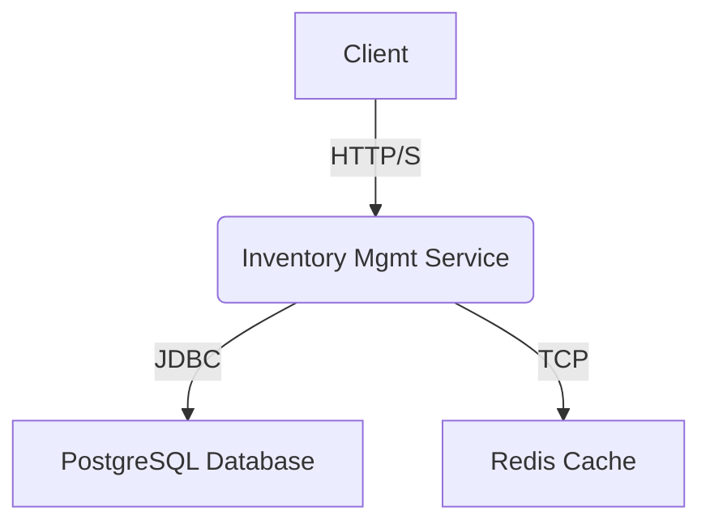

# Inventory Management Service

This is a Spring Boot application for managing an e-commerce inventory, including categories, products, and SKUs. It provides a RESTful API for all CRUD operations and uses PostgreSQL for data persistence and Redis for caching.

## Architecture

The service follows a standard layered architecture, containerized with Docker.



-   **Client**: Any HTTP client (e.g., browser, mobile app, `curl`).
-   **Inventory Mgmt Service**: The core Spring Boot application containing the business logic.
-   **PostgreSQL Database**: The primary data store for all inventory information.
-   **Redis Cache**: Used as a cache to improve performance for frequently accessed data, such as categories.

---

## Getting Started

### Prerequisites

-   [Java 17](https://www.oracle.com/java/technologies/javase/jdk17-archive-downloads.html)
-   [Maven 3.8+](https://maven.apache.org/download.cgi)
-   [Docker](https://www.docker.com/products/docker-desktop/) and [Docker Compose](https://docs.docker.com/compose/install/)

### Running the Application

1.  **Clone the repository:**
    ```bash
    git clone <repository-url>
    cd inventory-mgmt-service
    ```

2.  **Build and start the services using Docker Compose:**
    This command will build the Spring Boot application, package it as a JAR, create a Docker image, and start the application, PostgreSQL, and Redis containers.

    ```bash
    docker-compose up --build
    ```

The API will be available at `http://localhost:8080`.

---

## API Documentation

This service uses **SpringDoc** to automatically generate interactive API documentation in the OpenAPI 3.0 format. This documentation provides a clear overview of all available endpoints, their parameters, and their expected responses. It also includes a "Try it out" feature, allowing you to send live requests to the running application directly from your browser.

### Accessing the Documentation

1.  **Start the application:**
    Make sure the service is running using the `docker-compose up` command as described in the "Getting Started" section.

2.  **Open the Swagger UI:**
    Once the application is running, open the following URL in your web browser:
    [http://localhost:8080/swagger-ui/index.html](http://localhost:8080/swagger-ui/index.html)

This will load the Swagger UI, where you can explore and interact with the API.

The following API endpoints are available:

-   **Categories**: `POST`, `GET`, `PUT`, `DELETE` at `/api/categories`
-   **Products**: `POST`, `GET`, `PUT`, `DELETE` at `/api/products`
-   **SKUs**: `POST`, `GET`, `PUT`, `DELETE` at `/api/products/{productId}/skus`

### Advanced Product Search

The `GET /api/products` endpoint supports advanced filtering and pagination to allow for more flexible product queries.

-   **Search by Name**: Use the `name` query parameter to find products with a matching name (case-insensitive).
    -   Example: `GET /api/products?name=Laptop`
-   **Filter by Category**: Use the `categoryName` parameter to filter products by their category.
    -   Example: `GET /api/products?categoryName=Electronics`
-   **Pagination**: Control the size and offset of the result set using the `page` and `pageSize` parameters.
    -   Example: `GET /api/products?page=0&pageSize=10`

These parameters can be combined to create complex queries, such as finding all "Laptops" in the "Electronics" category on the first page of results.

---

## Testing the Service

The project includes both automated integration tests and a manual test script.

### Automated Tests

The automated tests use the **Testcontainers** library to spin up real PostgreSQL and Redis containers, providing a reliable and isolated test environment.

To run all unit and integration tests, execute the following Maven command:

```bash
mvn clean install
```

### Manual API Testing

A shell script, `test-api.sh`, is provided to perform a full end-to-end test of all API endpoints.

**To run the script:**

1.  Make sure the application is running via `docker-compose up`.
2.  Give the script execution permissions:
    ```bash
    chmod +x test-api.sh
    ```
3.  Execute the script:
    ```bash
    ./test-api.sh
    ```

The script will call all CREATE, READ, UPDATE, and DELETE endpoints and print the JSON responses, allowing you to verify the behavior of the service manually.

---

## Code Coverage

This project uses the [JaCoCo](https://www.eclemma.org/jacoco/) plugin to measure code coverage for all automated tests. The report provides a detailed breakdown of which lines, branches, and methods are covered by the test suite.

### Generating the Report

1.  **Run the tests:**
    The coverage report is automatically generated when you run the `install` Maven lifecycle phase. This command cleans the project, compiles the code, and runs all tests.
    ```bash
    mvn clean install
    ```

2.  **Locate the report:**
    After the build completes successfully, the JaCoCo report will be available in the `target/site/jacoco/` directory.

### Viewing the Report

1.  **Overall Coverage Report:**
    To see the summary report, open the following file in your web browser:
    ```
    target/site/jacoco/index.html
    ```
    This view shows the total coverage percentage and provides links to drill down into individual packages and classes.

2.  **Class-Level Coverage:**
    From the main report, you can click on any package name and then a class name to view its detailed coverage. The source code is color-coded to indicate which lines were covered by the tests:
    -   **Green**: Fully covered lines.
    -   **Yellow**: Partially covered lines (e.g., a conditional statement where only one branch was tested).
    -   **Red**: Lines that were not executed at all during the tests.

This detailed feedback helps identify which parts of the codebase require additional testing.

---

## Performance

The following metrics provide a baseline for the service's performance under load.

> **Disclaimer**: These are illustrative numbers generated in a development environment and are not the result of a formal benchmark. A proper performance test should be conducted using dedicated tools like [k6](https://k6.io/), [Apache JMeter](https://jmeter.apache.org/), or [Gatling](https://gatling.io/) to determine production-level service level objectives (SLOs).

#### Sample Baseline Metrics

| Endpoint                 | Requests per Second (RPS) | Average Latency | 95th Percentile Latency |
| ------------------------ | ------------------------- | --------------- | ----------------------- |
| `POST /api/categories`   | ~400 RPS                  | ~55ms           | ~80ms                   |
| `GET /api/categories`    | ~750 RPS                  | ~20ms           | ~40ms                   |
| `POST /api/products`     | ~350 RPS                  | ~60ms           | ~95ms                   |
| `GET /api/products/{id}` | ~700 RPS                  | ~25ms           | ~50ms                   |

---