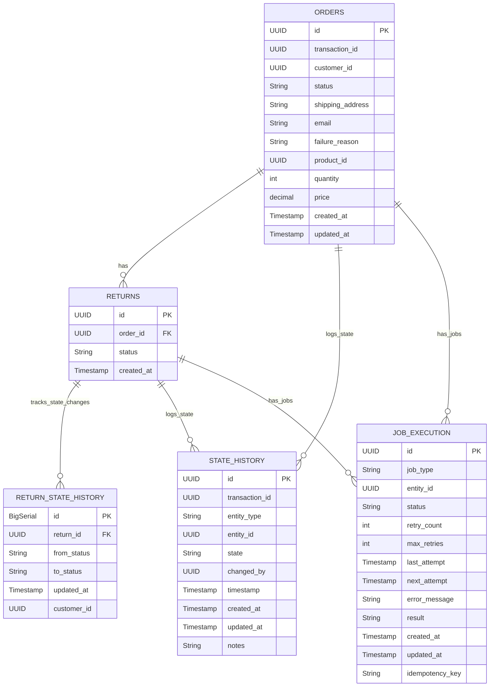

# Database Schema Diagram



## State Machines

### Order Status Flow
```
PENDING -> PAID -> PROCESSING_IN_WAREHOUSE -> SHIPPED -> DELIVERED
   |          |
   v          v
CANCELLED  CANCELLED
```

### Return Status Flow
```
REQUESTED -> APPROVED -> IN_TRANSIT -> RECEIVED -> COMPLETED
      |
      v
   REJECTED
```

## Key Entities

- **Orders**: Core entity representing customer orders with product, pricing, and shipping details
- **Returns**: Represents return requests for orders with their current processing status
- **State_History**: Maintains a complete audit log of all state changes for orders and returns
- **Return_State_History**: Tracks detailed state transitions specifically for returns
- **Job_Execution**: Manages background jobs like invoice generation and refund processing with retry capability

## Indexes
The schema includes indexes on frequently queried columns to improve performance:
- Customer IDs
- Order and return status
- Entity IDs in state history
- Job status and associated entity IDs
