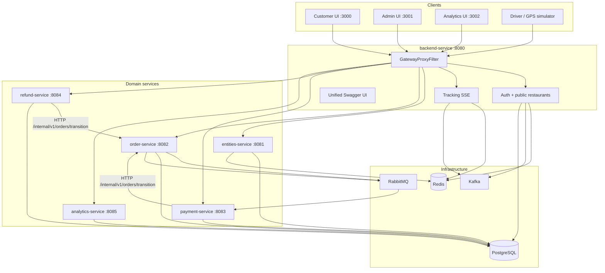
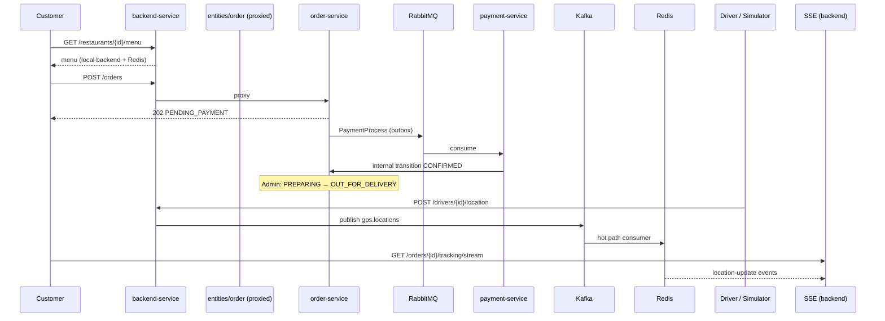

# SwiftEats — Architecture

This document describes the architecture of **SwiftEats**, a real-time food delivery platform built as **six Spring Boot microservices** (plus a shared library) with event-driven infrastructure. It covers Assignment 1 (operational backend) and the shared data foundation for Assignment 2 (delivery failure analytics).

**Related documents:** [HIGH_LEVEL_DESIGN.md](./HIGH_LEVEL_DESIGN.md) · [LOW_LEVEL_DESIGN.md](./LOW_LEVEL_DESIGN.md) · [DOMAIN_MODEL.md](./DOMAIN_MODEL.md) · [API-SPECIFICATION.yml](./API-SPECIFICATION.yml)

---

## 1. Architectural pattern

### Choice: Microservices (extracted from modular monolith) + event-driven infrastructure

SwiftEats runs as **six independently buildable Spring Boot services** sharing a common library (`platform-lib`). A **backend-service** gateway on port **8080** is the single public entry point for UIs and Swagger; it proxies domain routes to internal services.

| Service | Port | Responsibility |
|---------|------|----------------|
| **backend-service** | 8080 | Auth, public restaurant browse, GPS tracking/SSE, API gateway, unified Swagger UI |
| **entities-service** | 8081 | Restaurant / menu / customer / driver admin CRUD |
| **order-service** | 8082 | Order initiation → lifecycle (state machine, outbox) |
| **payment-service** | 8083 | Async payment worker (RabbitMQ), mock gateway |
| **refund-service** | 8084 | Refund initiation → successful (mock gateway) |
| **analytics-service** | 8085 | CSV import + insight APIs |

Shared code lives in `services/platform-lib` (entities, repositories, DTOs). Each service activates only its beans via `@ServiceScope` filtering.

| Alternative | Why not chosen (for MVP) |
|-------------|--------------------------|
| Single monolith only | Harder to evolve teams/deployments per domain |
| Full microservices per table | Operational overhead exceeds 500 orders/min MVP needs |
| Serverless | Poor fit for SSE, Kafka consumers, and local docker-compose validation |

### Shared library (`platform-lib`)

Domain code lives in one Maven JAR; each deployable activates a subset via `@ServiceScope`:

```
com.swifteats
├── auth/           Customer register/login/profile (backend-service)
├── restaurant/     Public browse + admin CRUD (backend + entities + order)
├── order/          Lifecycle, outbox, state machine (order-service)
├── tracking/       GPS ingest, SSE (backend-service)
├── analytics/      CSV import + insight APIs (analytics-service)
├── refund/         Refund initiation → success (refund-service)
├── gateway/        HTTP proxy + OpenAPI aggregation (backend-service)
├── client/         B2B business clients (A2 alignment)
└── common/         Security, exceptions, shared enums, runtime scoping
```

**Rules:**

- No cross-module JPA access at the code level — use **service interfaces** (`RestaurantService`, `OrderInternalClient`, …).
- Cross-service calls use **HTTP internal APIs** (`/internal/v1/*`) or **RabbitMQ** (payment worker).
- UIs and Postman hit **backend-service :8080** only; the gateway forwards domain routes.

---

## 2. System context



---

## 3. Service responsibilities & routing

| Service | Port | External routes (via gateway) | Internal routes |
|---------|------|------------------------------|-----------------|
| **backend-service** | 8080 | `/api/v1/auth/*`, `/api/v1/restaurants/*`, `/api/v1/drivers/*`, `/api/v1/orders/{id}/tracking*` | — |
| **entities-service** | 8081 | `/api/v1/admin/restaurants/*` | — |
| **order-service** | 8082 | `/api/v1/orders`, `/api/v1/admin/orders/*` | `POST /internal/v1/orders/{id}/transition` |
| **payment-service** | 8083 | `/api/v1/payments/mock/*` | `POST /internal/v1/payments/process` |
| **refund-service** | 8084 | `/api/v1/refunds/*` | `POST /internal/v1/refunds/{id}/process` |
| **analytics-service** | 8085 | `/api/v1/analytics/*`, `/api/v1/admin/analytics/*` | — |

Gateway is enabled with `swifteats.gateway.enabled=true` on backend-service. Tracking paths (`/tracking`, `/tracking/stream`) are **not** proxied — they are served locally on backend-service.

**Unified Swagger UI:** http://localhost:8080/swagger-ui.html exposes six OpenAPI documents (dropdown). Proxied at `/v3/api-docs/{backend|entities|order|payment|refund|analytics}`.

Each service is built independently:

```bash
cd services && mvn -pl order-service -am package
```

---

## 4. Component communication

### 4.1 Restaurant (read-heavy — backend-service)

**Goal:** P99 menu fetch < 200ms under load.

```
GET /restaurants/{id}/menu
  → MenuCacheService (Redis GET restaurant:{id}:menu)
  → on MISS: PostgreSQL single fetch + SET cache (10 min TTL)
  → return JSON bundle (restaurant status + menu items)
```

List/search results are cached with key `restaurants:list:{sha256(query)}` (5 min TTL). Admin writes invalidate menu and list caches.

### 4.2 Order + payment (write-heavy — order-service + payment-service)

**Goal:** 500 orders/min; payment failures must not block order acceptance.

```
POST /orders (Idempotency-Key)
  → validate restaurant (RestaurantService.requireAcceptingOrders)
  → validate menu items + snapshot prices
  → TX: INSERT order + items + outbox_event (OrderCreated, PaymentProcess)
  → 202 Accepted (PENDING_PAYMENT)

OutboxPoller (order-service, 1s)
  → publish PaymentProcess → RabbitMQ payment.process.queue

PaymentWorker (payment-service)
  → MockPaymentGateway.charge()
  → HTTP POST /internal/v1/orders/{id}/transition → CONFIRMED | PAYMENT_FAILED
```

**Why outbox + RabbitMQ?**

| Mechanism | Role |
|-----------|------|
| **Transactional outbox** | Order row and payment event committed atomically — no lost orders |
| **RabbitMQ** | Decouples API thread from payment worker; supports retry + DLQ |

### 4.3 Refund flow (refund-service)

```
POST /api/v1/refunds (Idempotency-Key)
  → validate order eligible (DELIVERED, CANCELLED, PAYMENT_FAILED, FAILED)
  → INSERT refund (INITIATED)
  → async RefundWorker → mock gateway
  → SUCCESSFUL | FAILED
  → on success: HTTP transition order → RETURNED
```

### 4.4 Tracking (stream-heavy — backend-service)

**Goal:** Design for 10,000 drivers × 1 update/5s (2,000 events/sec); local demo at 50 drivers / ~10 events/sec.

```
POST /drivers/{id}/location  → 202 (no DB on request thread)
  → Kafka topic gps.locations (key = driverId)

GpsHotPathConsumer (group: gps-hot-path)
  → Redis SET driver:{id}:location (30 min TTL)
  → Redis PUBLISH channel:driver:{id}

GpsArchiveConsumer (group: gps-archive)
  → sampled INSERT driver_location_archive (every 30s/driver, or every 5th event when orderId set)

GET /orders/{id}/tracking/stream (SSE)
  → SseTrackingService subscribes to channel:driver:{id}
  → fan-out location-update events + 15s ping heartbeat
```

**Driver assignment** occurs on order transition to `OUT_FOR_DELIVERY` (first `AVAILABLE` driver). Redis stores `order:{id}:driver` for fast lookup.

### 4.5 Analytics (Assignment 2 — analytics-service)

- Imports `third-assignment-sample-data-set/*.csv` into `analytics.*` schema
- Live operational data uses `public.*` schema with aligned field names ([DOMAIN_MODEL.md](./DOMAIN_MODEL.md))
- Full correlation engine and insight APIs (UC1–UC6) implemented in `analytics-service`

---

## 5. End-to-end flow



---

## 6. Technology justification

| Technology | Use in SwiftEats | Justification |
|------------|------------------|---------------|
| **Java 17 + Spring Boot 3.3** | Application runtime | Team familiarity, mature ecosystem, actuator health checks |
| **PostgreSQL 15** | Source of truth | ACID orders, Flyway migrations, analytics + operational schemas |
| **Redis 7** | Menu cache, GPS hot path, SSE pub/sub | Sub-ms reads for P99 menu path; absorbs GPS write rate without hammering PostgreSQL |
| **Apache Kafka 3.7** | GPS location stream | Durable, partitioned ingest at 2,000 events/sec; multiple consumer groups (hot + archive) |
| **RabbitMQ 3.13** | Async payment queue | Task queue semantics, DLQ for failed payments, simpler than Kafka for request/reply payment work |
| **Flyway** | Schema versioning | Migrations V1–V12; run via **`db-migrate`** compose service before JVM services start |
| **Docker Compose** | Local stack | Six API services + infra + three UIs, single command |
| **SSE** | Live driver tracking | One-way server→client push; served from backend-service |

### Deliberate omissions (local / $0 infra)

- No paid traffic/weather APIs — Assignment 2 uses sample CSV + mock context
- No Kubernetes — docker-compose only for submission validation
- **backend-service** acts as API gateway (HTTP reverse proxy + unified Swagger) — no separate gateway product

---

## 7. Data architecture

| Schema | Purpose | ID type |
|--------|---------|---------|
| `public.*` | Live SwiftEats operations | UUID |
| `analytics.*` | Imported Assignment 2 CSV sample | BIGINT |

| `public.refund` | Refund records (initiation → success) | UUID |

Shared field semantics (failure reasons, kitchen prep timestamps, fleet logs) are documented in [DOMAIN_MODEL.md](./DOMAIN_MODEL.md) so Assignment 2 correlation does not require remapping.

---

## 8. Non-functional attributes

| Attribute | How addressed |
|-----------|---------------|
| **Scalability** | Scale services independently; Redis/Kafka shared; stateless replicas per service |
| **Resilience** | Outbox pattern, payment DLQ, gateway degrades if a downstream service is down |
| **Performance** | Menu cache-aside; GPS never writes PostgreSQL on ingest request thread |
| **Maintainability** | `platform-lib` + `@ServiceScope`, Flyway DDL, OpenAPI spec, unit tests |
| **Security** | Admin routes: `X-Admin-Api-Key`; customer auth via register/login + API token headers; internal routes: `X-Internal-Service-Key` |
| **Data labelling** | Seed and user-created display names prefixed **`[T] `** (`TemporaryDataLabels`) for temporary/demo data |

### Performance validation (Assignment 1)

The assignment specifies production-scale **design targets** and smaller **local demo** targets. Evaluators run on a laptop via `docker compose`; the table below maps each NFR to architectural choices and what this repository validates locally.

| NFR | Design target | Architectural mechanism | Validated locally |
|-----|---------------|-------------------------|-------------------|
| Order throughput | 500 orders/min | Outbox + RabbitMQ decouple order acceptance from mock payment; horizontal scale of `order-service` / `payment-service` | E2E smoke (`scripts/e2e-smoke.sh`); Postman create-order SLO (&lt; 500 ms single request) |
| Menu latency | P99 &lt; 200 ms under load | Redis cache-aside (`MenuCacheService`); denormalized menu payload | Postman menu SLO smoke (&lt; 200 ms); optional menu burst folder |
| GPS stream | ~2,000 events/sec (10k drivers) | Kafka partitioned ingest; Redis hot path; async archive to PostgreSQL | `DriverGpsSimulator` at **50 drivers / 5 s** ≈ 10 evt/s; log line `GPS simulator initialized for 50 drivers` |
| Observability | Health + API spec | Spring Actuator on gateway; unified Swagger UI | `GET /actuator/health`; OpenAPI at `/swagger-ui.html` |

Automated soak/load tests at full 500 orders/min are not included in the submission MVP; architecture and single-request SLO smokes demonstrate the critical paths. See [README.md § Performance & scale validation](./README.md#performance--scale-validation).

---

## 9. Deployment topology (local)

```
docker-compose.yml
├── postgres:5432
├── redis:6379
├── rabbitmq:5672 (+ management UI :15672)
├── kafka:9092
├── backend-service:8080      ← public entry + Swagger hub
├── entities-service:8081
├── order-service:8082
├── payment-service:8083
├── refund-service:8084
├── analytics-service:8085
├── ui-service:3000
├── admin-dashboard:3001
└── analytics-dashboard:3002
```

All services share one PostgreSQL database in local dev (schema `public` + `analytics`). Flyway runs in the **`db-migrate`** compose service before any JVM service starts.

Environment variables are documented in [README.md](./README.md).

---

## 10. Future evolution

1. **Database-per-service** — split PostgreSQL schemas or instances when moving to production
2. **Service mesh / mTLS** — secure internal `/internal/v1/*` calls (currently trusted network in docker-compose)
3. **Assignment 2 live correlation** — Kafka consumers populate analytics from live `order.events` (sample CSV import already works)
4. **Circuit breaker** — Resilience4j on payment/refund mock gateways

---

## 11. Key design decisions log

| Decision | Choice | Rationale |
|----------|--------|-----------|
| Live tracking transport | SSE on backend-service | Assignment-friendly, one-way push |
| Payment async | Outbox (order) + RabbitMQ + worker (payment) | Atomic order + event; service isolation |
| Cross-service order updates | HTTP internal API | Payment/refund workers call order-service transition |
| GPS path | Kafka → Redis (backend) | Matches stream volume; PostgreSQL only for sampled archive |
| Restaurant search | PostgreSQL + Redis list cache | Good enough at MVP scale |
| Deployment model | Six services + platform-lib | Independently buildable; gateway preserves single URL for UIs |
| Monolith vs microservices | **Microservices (local)** | Domain boundaries map to deployables; `swifteats-api` kept as legacy reference |
