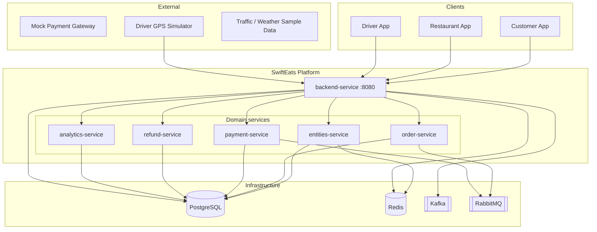
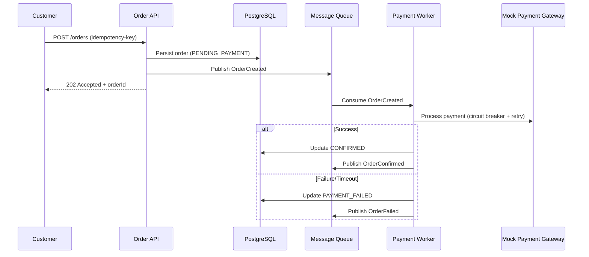
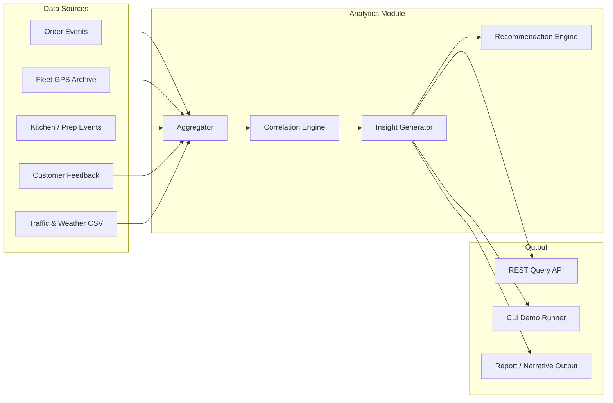
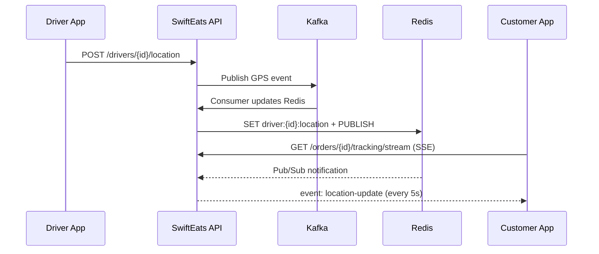

# SwiftEats — High-Level Design

Design document for **SwiftEats** — covering both assignments in a single platform:

| Assignment | Focus | Role in platform |
|---|---|---|
| **Assignment 1** (`2026-H1-Assignment-1.txt`) | Real-time food delivery backend | Core operational modules (orders, menu, GPS tracking) |
| **Assignment 2** (`2026-H1-AI-Assignment-2.txt`) | Delivery failure root-cause analysis & insights | Analytics module consuming operational data + external context |

**Last updated:** Microservices split — six Spring Boot services + `platform-lib`, backend gateway on :8080, unified Swagger UI. Assignment 2 analytics runs in **analytics-service**.

**Implementation detail:** See [LOW_LEVEL_DESIGN.md](./LOW_LEVEL_DESIGN.md) for database schema, class structure, message contracts, and detailed flows.

---

## 1. Problem Summary

| Requirement | Target | Implication |
|---|---|---|
| Order processing | **500 orders/min** (~8.3/sec) | Moderate write load; payment must not block the critical path |
| Menu & restaurant browse | **P99 < 200ms** under load | Read-heavy, cache-first design |
| Driver GPS ingestion | **10,000 drivers × 1 update/5s = 2,000 events/sec** | Write-heavy stream; hot-path storage must be in-memory |
| Local validation | **50 drivers → 10 events/sec** | Driver simulator + full stack via `docker-compose` |

Three workloads with very different characteristics → design for **independent scaling** even if we start as a **modular monolith**.

### Assignment 2 alignment (future-proofing)

Assignment 2 asks for **multi-domain aggregation, event correlation, narrative insights, and actionable recommendations** for delivery failures. That is not part of Assignment 1's MVP, but the platform should **emit and retain the data** Assignment 2 needs so both assignments live in one service without rework.

| Assignment 2 data domain | SwiftEats source (Assignment 1) | Design implication |
|---|---|---|
| Order & shipment timestamps | Order Module state history | Already planned — extend with `delayReason`, `failureReason` |
| Fleet & driver GPS logs | Tracking Module | Hot path stays Redis; **cold path** archives sampled GPS to PostgreSQL via Kafka consumer |
| Warehouse / kitchen prep | Restaurant Module | Track prep start/end, stockouts (`MenuItem.available = false`), dispatch delays |
| Customer feedback | Feedback sub-module (new) | Unstructured text linked to `orderId`; stored in PostgreSQL |
| Contextual data (traffic, weather) | External mock / sample CSV | Import from `third-assignment-sample-data-set`; no paid APIs |

Assignment 2 deliverable is a **sample analytics program + write-up + demo** — implemented as an **Analytics & Insights Module** (CLI/batch + REST query APIs), not a separate microservice.

---

## 2. Recommended Architecture Pattern

### Choice: **Microservices + shared library + event-driven infrastructure**

Six independently buildable Spring Boot services share **`platform-lib`** (domain code, JPA, DTOs). **backend-service** (:8080) is the single public entry point (HTTP gateway + auth + tracking + unified Swagger). Domain services communicate via **RabbitMQ** (payments) and **HTTP internal APIs** (`/internal/v1/*`).

```
┌─────────────────────────────────────────────────────────────────────────────┐
│  backend-service :8080  (gateway, auth, public restaurants, GPS/SSE)       │
└───────┬──────────┬──────────┬──────────┬──────────┬──────────────────────┘
        │          │          │          │          │
        ▼          ▼          ▼          ▼          ▼
  entities    order      payment     refund    analytics
   :8081      :8082       :8083       :8084      :8085
        │          │          │          │          │
        └──────────┴──────────┴──────────┴──────────┘
                           │
              platform-lib (shared JAR, @ServiceScope)
                           │
        ┌──────────────────┼──────────────────┐
        ▼                  ▼                  ▼
   PostgreSQL           Redis              Kafka
   (shared DB)      (cache + GPS)     (GPS + future events)
                           │
                      RabbitMQ
                   (async payment queue)
```

### Why microservices (for this codebase)?

- **Independent builds** — `mvn -pl order-service -am package` without redeploying tracking
- **Clear domain boundaries** — entities, order, payment, refund, analytics map to teams/services
- **Gateway preserves DX** — UIs still use one URL (:8080) and one Swagger UI

### Why shared library instead of duplicated code?

- Single Flyway migration set, shared entities, one test suite for domain logic
- `@ServiceScope` filter selects which beans each service loads

### Why not full database-per-service yet?

- Local docker-compose simplicity; all services share one PostgreSQL instance
- Production evolution: split schemas or DB instances per service (see ARCHITECTURE.md)

---

## 3. System Context Diagram



---

## 4. Core Modules

### 4.1 Restaurant & Menu Module (Read-Optimized)

**Responsibility:** Restaurant listing with **search/filters**, menu fetch, open/closed status.

**Browse & search capabilities:**

| Feature | Implementation |
|---|---|
| List restaurants | Paginated `GET /restaurants` |
| Filter by city | DB index on `city` + Redis cache for hot cities |
| Filter by cuisine | Many-to-many `restaurant_cuisines` table |
| Filter by rating / isOpen | Query params; cached result sets for common combos |
| Search by name | PostgreSQL `ILIKE` or full-text search (`tsvector`) |
| Menu + status | `GET /restaurants/{id}/menu` — primary P99 target |

**Hot path for P99 < 200ms:**

```
Client → API → Redis (cache hit) → response
                    ↓ miss
               PostgreSQL → populate Redis → response
```

| Decision | Rationale |
|---|---|
| **Cache-aside in Redis** | Menu changes infrequently; reads dominate |
| **Composite cache key** `restaurant:{id}:menu` | Single round-trip for menu + status |
| **TTL 5–15 min + explicit invalidation** | Balance freshness vs. performance |
| **Denormalized cache payload** | Avoid N+1 DB queries on cache miss |
| **Optional: pre-warm on deploy** | Stable P99 under load spikes |

**Status handling:** Store `isOpen`, `estimatedWaitMins` in Redis; update via admin API or scheduled job.

**Assignment 2 hooks (kitchen / warehouse proxy):**

- Emit `KitchenPrepStarted`, `KitchenPrepCompleted`, `MenuItemStockout` events to Kafka on state changes
- Record `prepStartedAt`, `prepCompletedAt`, `dispatchDelayMins` on orders — links prep delays to downstream delivery failures
- Restaurant acts as the **warehouse equivalent** in food delivery (Assignment 2 sample queries reference "Warehouse B")
- **Onboarding sub-module** registers restaurants and menus via `/admin/*` APIs (see §18)

---

### 4.2 Order Module (Resilient Write Path)

**Responsibility:** Cart validation, order creation, payment orchestration, lifecycle.

**Critical design:** Payment is **async and decoupled** — third-party failure must not break order-taking.



| Resilience pattern | Application |
|---|---|
| **Idempotency keys** | Duplicate submits return same order |
| **Async payment via queue** | API responds in ~50–100ms regardless of gateway |
| **Circuit breaker** on mock gateway | Fail fast after repeated errors |
| **Retry with exponential backoff** | Transient gateway failures |
| **Saga / compensating action** | Payment fail → cancel order + release resources |
| **Outbox pattern** | DB write + event publish are atomic |

**Throughput:** 500 orders/min ≈ 8.3/sec — a single PostgreSQL instance with connection pooling is sufficient.

**Assignment 2 hooks (order & shipment data):**

- Extend state history with timestamps for every transition (`pickupAt`, `outForDeliveryAt`, `deliveredAt`)
- Capture structured failure/delay reasons: `LATE_PREPARATION`, `TRAFFIC`, `DRIVER_UNAVAILABLE`, `ADDRESS_NOT_FOUND`, `PAYMENT_FAILED`, etc.
- Publish domain events to Kafka (`OrderDelayed`, `OrderFailed`, `OrderDelivered`) for analytics consumers
- Link orders to `customerId` / `clientId` for per-client failure analysis (Assignment 2 use case #2, #6)

---

### 4.3 Tracking Module (High-Throughput GPS)

**Responsibility:** Ingest driver GPS, maintain latest position, feed live tracking.

**Ingestion flow (2,000 events/sec design):**

```
Driver → POST /drivers/{id}/location → Kafka (partition by driverId)
                                              ↓
                                    Tracking Consumer(s)
                                              ↓
                              Redis: driver:{id}:location (latest only)
                                              ↓
                              Redis Pub/Sub → SSE → Customer
```

| Decision | Rationale |
|---|---|
| **Kafka, not direct DB writes** | Buffers spikes; horizontal consumer scaling |
| **Partition by `driverId`** | Ordering per driver; parallel consumption |
| **Redis for latest position only** | Sub-ms reads; no need to persist every ping to PostgreSQL |
| **Cold path: sampled GPS archive** | Kafka consumer writes GPS snapshots (every 30s or on order state change) to PostgreSQL for Assignment 2 fleet log analysis |
| **Skip full GPS in PostgreSQL** | 2,000 raw writes/sec is unnecessary; sampling keeps local Mac viable |

**Customer live tracking (SSE — see §14):**

- Customer opens order → `GET /orders/{id}/tracking/stream` (SSE)
- Server maps order → assigned driver → subscribes to driver location updates via Redis Pub/Sub
- Push every 5s (or on significant movement)
- REST fallback: `GET /orders/{id}/tracking` for latest snapshot

---

### 4.4 Driver GPS Simulator (Local Testing)

Standalone tool/container:

- Simulates **up to 50 drivers**
- Each sends location every **5 seconds** → **10 events/sec**
- Configurable via env vars (`DRIVER_COUNT`, `INTERVAL_SEC`)
- Random routes around Maharashtra cities (Pune, Mumbai, Nagpur)

---

### 4.5 Analytics & Insights Module (Assignment 2 — planned)

**Responsibility:** Aggregate multi-domain data, correlate events, generate human-readable root-cause narratives, and surface actionable recommendations.

**Scope note:** Assignment 2 expects a write-up, sample program, demo video, and recorded outputs — **not necessarily a full UI**. This module can start as a **CLI + REST query API** inside the same monolith, reading from PostgreSQL and Kafka-retained events.



**Capabilities mapped to Assignment 2 sample use cases:**

| Use case | Analytics approach |
|---|---|
| Why deliveries delayed in city X yesterday? | Filter orders by city + date; correlate delays with traffic data and prep times |
| Why did Client X's orders fail past week? | Group by `clientId`; rank failure reasons from structured tags + feedback NLP |
| Top reasons linked to Warehouse B in August? | Filter by restaurant/warehouse ID; aggregate `failureReason` + kitchen delay events |
| Compare failure causes City A vs City B | Cross-tabulate failure reasons by city for a date range |
| Festival period failures & preparation | Overlay traffic/weather context; detect volume spikes vs. capacity |
| Onboard Client Y (+20K orders/month) | Project failure rate from historical correlation; recommend staffing/routing changes |

**Insight generation options (OSS, local):**

| Approach | When to use |
|---|---|
| **Rule-based correlation** | MVP — deterministic, testable, no LLM dependency |
| **Template narratives** | Convert correlation results to human-readable paragraphs |
| **Local LLM via Ollama** (optional) | Richer narratives for demo; runs on Mac, no paid API |

**Recommendation:** Start with rule-based correlation + template narratives for reliability; optionally enhance with Ollama for Assignment 2 demo polish.

**API surface (draft — Assignment 2):**

| Method | Endpoint | Purpose |
|---|---|---|
| `GET` | `/analytics/delays?city=&date=` | Delay root-cause breakdown for a city |
| `GET` | `/analytics/failures?clientId=&from=&to=` | Client-specific failure analysis |
| `GET` | `/analytics/failures/by-warehouse?warehouseId=&month=` | Warehouse/restaurant-linked failures |
| `GET` | `/analytics/failures/compare?cityA=&cityB=&month=` | City comparison |
| `POST` | `/analytics/insights/query` | Natural-language query → structured insight response |
| `POST` | `/feedback` | Submit customer complaint linked to order |

---

## 5. Technology Stack

**Principle:** 100% open-source. No paid cloud services, no managed infra. Everything runs locally via Docker Compose on a Mac.

| Component | Choice | Justification |
|---|---|---|
| **Language / Framework** | **Java 21 + Spring Boot 3** | Prior Spring experience; meets all target metrics; strong Kafka/Redis/SSE support |
| **Primary DB** | PostgreSQL 15 | ACID for orders; JSONB for menu items; full-text search for restaurant name |
| **Cache** | Redis 7 | Sub-ms reads for menu; latest driver positions; Pub/Sub for SSE fan-out |
| **Event streaming** | Apache Kafka (KRaft, single broker) | GPS stream + **domain events** for Assignment 2 correlation |
| **Message queue** | RabbitMQ | Async mock payment; decouples order API from gateway |
| **API spec** | OpenAPI 3 (`API-SPECIFICATION.yml`) | Required deliverable |
| **Containerization** | Docker Compose | Single-command local startup |
| **Real-time** | **SSE (Spring MVC `SseEmitter`)** | One-way driver location push; no extra infra; see §14 |
| **Load testing** | k6 (OSS) | Menu P99 and order throughput validation |
| **Coverage** | JaCoCo + JUnit 5 | Required deliverable |
| **Analytics (A2)** | Rule engine + template narratives; Ollama optional | Local, OSS; no paid AI APIs required |

**Node.js fallback:** Only if Spring Boot cannot hit metrics during load testing. Not expected — Spring handles 8.3 orders/sec and 2K GPS events/sec comfortably.

**Local RAM note:** Kafka is the heaviest container (~512 MB–1 GB). Total stack fits comfortably in **16 GB RAM** (see §15).

---

## 6. Data Model (High-Level)

### Operational entities (Assignment 1)

```
Restaurant (= warehouse in Assignment 2 context)
├── id, name, address, city, isOpen, rating
└── MenuItems[]
    ├── id, name, price, category, available

Order
├── id, customerId, clientId, restaurantId, city
├── status, totalAmount, idempotencyKey, paymentStatus
├── failureReason, delayReason (structured enums)
├── prepStartedAt, prepCompletedAt, outForDeliveryAt, deliveredAt
└── OrderItems[]

Driver
├── id, name, status (AVAILABLE | ON_DELIVERY)
└── currentOrderId (nullable)

DriverLocation (Redis — hot path)
├── driverId, lat, lng, timestamp, heading

DriverLocationArchive (PostgreSQL — cold path, sampled)
├── driverId, orderId, lat, lng, timestamp
```

### Analytics entities (Assignment 2)

```
CustomerFeedback
├── id, orderId, customerId, text, sentiment (optional), createdAt

ContextualEvent (imported from sample dataset)
├── id, city, date, type (TRAFFIC | WEATHER | FESTIVAL), severity, description

DeliveryInsight (generated)
├── id, queryType, parameters (JSON), narrative, recommendations[], generatedAt
```

### Kafka topic plan (shared event bus)

| Topic | Producer | Consumer(s) | Purpose |
|---|---|---|---|
| `gps.locations` | Tracking Module | Tracking (hot), Analytics (cold archive) | Raw GPS stream |
| `order.events` | Order Module | Analytics, audit | State transitions, failures, delays |
| `kitchen.events` | Restaurant Module | Analytics | Prep delays, stockouts |
| `feedback.events` | Feedback API | Analytics | Customer complaints |

**Order status flow:**

```
PENDING_PAYMENT → CONFIRMED → PREPARING → OUT_FOR_DELIVERY → DELIVERED
                      ↓              ↓              ↓
               PAYMENT_FAILED   DELAYED        FAILED (with reason)
                      ↓
                  CANCELLED
```

---

## 7. API Surface (Draft)

| Method | Endpoint | Module | Notes |
|---|---|---|---|
| `GET` | `/restaurants` | Restaurant | List + search/filters (city, cuisine, rating, isOpen, name) |
| `GET` | `/restaurants/{id}/menu` | Restaurant | **P99 target endpoint** — cache-first |
| `POST` | `/admin/restaurants` | Restaurant Onboarding | Register restaurant (admin/partner) |
| `PUT` | `/admin/restaurants/{id}` | Restaurant Onboarding | Update profile, hours, status |
| `POST` | `/admin/restaurants/{id}/menu` | Restaurant Onboarding | Add / update menu items |
| `PUT` | `/admin/restaurants/{id}/menu/{itemId}` | Restaurant Onboarding | Toggle availability (stockout) |
| `POST` | `/refunds` | Refund | Initiate refund (Idempotency-Key); async processing |
| `GET` | `/refunds` | Refund | List customer refunds |
| `GET` | `/refunds/{id}` | Refund | Refund status |
| `POST` | `/auth/register` | Auth | Customer registration |
| `POST` | `/auth/login` | Auth | Customer login |
| `GET` | `/auth/me` | Auth | Current profile |
| `PATCH` | `/auth/profile` | Auth | Update profile |
| `GET` | `/admin/restaurants` | Entities | List restaurants (admin) |
| `PATCH` | `/admin/restaurants/{id}` | Entities | Update restaurant |
| `DELETE` | `/admin/restaurants/{id}` | Entities | Soft-delete (SUSPENDED) |
| `GET` | `/orders` | Order | List customer orders (`scope=active\|history\|all`) |
| `POST` | `/orders/{id}/cancel` | Order | Cancel if allowed |
| `POST` | `/drivers/{id}/location` | Tracking | GPS ingestion |
| `GET` | `/orders/{id}/tracking` | Tracking | Latest driver position (REST snapshot) |
| `GET` | `/orders/{id}/tracking/stream` | Tracking | Live location stream (SSE) |
| `POST` | `/payments/mock/process` | Order | Internal mock gateway |
| `POST` | `/feedback` | Analytics | Customer complaint linked to order |
| `GET` | `/analytics/delays` | Analytics | Delay root-cause breakdown (Assignment 2) |
| `GET` | `/analytics/failures` | Analytics | Failure analysis by client/city/warehouse |
| `POST` | `/analytics/insights/query` | Analytics | Natural-language insight query (Assignment 2) |

---

## 8. Non-Functional Requirements Mapping

### Scalability

| Component | Scale lever |
|---|---|
| Restaurant Module | Horizontal replicas + Redis cluster |
| Order Module | Horizontal replicas + DB connection pool |
| Tracking ingest | Kafka partitions + consumer groups |
| SSE connections | Redis Pub/Sub bridge (no sticky sessions needed) |

### Resilience

| Failure | Mitigation |
|---|---|
| Payment gateway down | Async queue + circuit breaker; orders still created |
| Redis down (menu) | Fallback to DB (higher latency, degraded not down) |
| Kafka lag | Consumers scale horizontally; GPS is eventually consistent |
| Single module crash | Others unaffected if split; in monolith, health checks + restart |

### Performance

| Path | Target | Strategy |
|---|---|---|
| Menu fetch | P99 < 200ms | Redis cache-aside, denormalized payload |
| Order create | < 500ms | Async payment; sync validation only |
| GPS ingest | 2,000/sec | Kafka buffering; no sync DB on hot path |
| Live tracking | ~5s refresh | Redis Pub/Sub → SSE |

---

## 9. Project Structure (see `PROJECT_STRUCTURE.md`)

```
swifteats/
├── docker-compose.yml
├── services/
│   ├── pom.xml                    # Maven parent reactor
│   ├── platform-lib/              # Shared domain JAR
│   ├── backend-service/           # :8080 gateway + auth + tracking
│   ├── entities-service/          # :8081 admin CRUD
│   ├── order-service/             # :8082 orders + outbox
│   ├── payment-service/           # :8083 payment worker
│   ├── refund-service/            # :8084 refunds
│   ├── analytics-service/         # :8085 analytics
│   └── swifteats-api/             # Legacy monolith (optional)
├── ui-service/                    # Customer SPA :3000
├── admin-dashboard/               # Admin SPA :3001
├── analytics-dashboard/           # Analytics SPA :3002
└── third-assignment-sample-data-set/
```

**Note:** `swifteats-api/` remains for reference; **docker-compose** uses the six-service stack.

---

## 10. Key Trade-offs

| Decision | Pros | Cons |
|---|---|---|
| Modular monolith vs microservices | **Six services + platform-lib** | Independent builds; gateway keeps single public URL |
| Kafka for GPS | Handles 2K/sec, replayable | Heavier locally than Redis Streams |
| Async payment | Resilient, fast API response | Eventual payment confirmation |
| Redis-only GPS storage | Fast reads, low DB load | No historical trail without extra store |
| SSE vs WebSocket | Simpler, no extra infra, fits one-way GPS push | No bidirectional channel (not needed) |
| Sampled GPS archive vs full history | Keeps local Mac viable; sufficient for A2 correlation | Not every GPS ping stored |
| Rule-based insights vs LLM | Deterministic, testable, no API cost | Less fluent narratives (Ollama optional) |

---

## 11. Local vs Production Scale

| Dimension | Local validation (docker-compose) | Production design target |
|---|---|---|
| Drivers | 50 (simulator) | 10,000 |
| GPS events/sec | 10 | 2,000 |
| Orders/min | Demo + k6 burst tests | 500 |
| Kafka | Single KRaft broker | Multi-broker cluster |
| Redis | Single instance | Sentinel / Cluster |
| Infra cost | **$0 — all OSS, runs on Mac** | Cloud TBD (out of scope) |

---

## 12. Migrating Existing Services (Copy → Adapt → Delete)

Two prior assignment services exist in this repo. **Copy the relevant code into `swifteats-api/`, adapt it, delete what does not apply, then remove the old folders.** Do not run them as separate services or Maven modules.

### Migration workflow

```
1. Create swifteats-api/ modular monolith scaffold
2. Copy reusable packages from each old service → target module
3. Rename packages (com.example.orderservice → com.swifteats.order, etc.)
4. Delete non-applicable classes in-place
5. Adapt entities, states, APIs to SwiftEats domain
6. Run tests; verify monolith builds
7. Delete orders-returns-mgmt-service/ and Inventory-mgmt-service/ folders
```

### `orders-returns-mgmt-service` → `swifteats-api/order/`

| Copy in | Delete / do not copy |
|---|---|
| `OrderService` state transition logic | `ReturnController`, `ReturnService`, entire returns package |
| `Order` entity skeleton (adapt fields) | `Return`, `ReturnStateChange` entities |
| `StateHistory` audit entity + repo | E-commerce states (`PROCESSING_IN_WAREHOUSE`, `SHIPPED`) |
| `GlobalExceptionHandler` | `InvoiceJobService`, PDF/email invoice generation |
| `MockPaymentController` + payment client | `RefundJobService`, refund flows |
| `JobScheduler` / job processor pattern | Gmail `EmailService` (unless needed later) |
| Optimistic locking, validation patterns | Single line-item constraint — extend to multi-item |
| Unit tests for order state machine | Return-related tests |

**After copy:** Add async payment (RabbitMQ), idempotency-key API, food delivery states, Kafka `order.events` publishing.

### `Inventory-mgmt-service` → `swifteats-api/restaurant/`

| Copy in | Delete / do not copy |
|---|---|
| Controller → Service → Repository layering | `SKUController`, SKU variant logic (size/color) |
| `CategoryController` pattern → `MenuCategory` | Product/SKU entity model as-is |
| `ProductController` pagination + filter queries | Separate category/product/SKU three-tier model |
| `GlobalExceptionHandler` | Unused Redis config stubs (reimplement properly) |
| DTO / mapper patterns | E-commerce product fields (brand, weight, etc.) |
| Testcontainers test setup | SKU stock-quantity logic (use `MenuItem.available` instead) |

**After copy:** Remodel to `Restaurant` + `MenuItem`, implement Redis cache-aside, add search/filters, add onboarding admin APIs.

### GPS, Tracking, Analytics — Build new (nothing to copy)

Neither old service has Kafka, GPS, SSE, or analytics. These modules are written from scratch.

### Post-migration repo layout

Only **`swifteats-api/`** remains as the backend. Old folders are deleted to avoid confusion for evaluators and to keep `docker-compose` single-entry.

---

## 13. Locked Decisions

| # | Question | Decision | Rationale |
|---|---|---|---|
| 1 | Language | **Java 21 + Spring Boot 3** | Prior Spring experience; metrics achievable without switching to Node |
| 2 | Architecture | **Microservices + platform-lib** | Six deployables; backend gateway on :8080 |
| 3 | Live tracking | **SSE** (not WebSocket) | One-way GPS push; no extra infra; simpler — see §14 |
| 4 | Restaurant scope | **List + menu + search/filters** | City, cuisine, rating, isOpen, name search |
| 5 | Infra | **Local only, OSS only, $0 cost** | No cloud assignment; Mac 16 GB RAM / 512 GB disk |
| 6 | Existing services | **Copy in, adapt, delete old folders** | Not separate deployables — merged into monolith |
| 7 | Assignment 2 | **Same service, fourth module** | Platform emits events/data; Analytics module consumes them |
| 8 | A2 insight engine | **Rule-based + templates first** | Ollama optional for richer demo narratives; no paid AI APIs |
| 9 | Restaurant onboarding | **Sub-module inside Restaurant** | Admin APIs — not a separate microservice |
| 10 | UI | **Optional demo client** | Not required by assignment; Postman/curl sufficient for eval |

---

## 18. Restaurant Onboarding

**Yes, restaurants need a way to join the platform** — but this does **not** require a separate onboarding microservice. It is a **sub-module** inside the Restaurant Module with admin/partner-facing APIs.

### Why not a separate service?

| Factor | Decision |
|---|---|
| Assignment scope | Backend platform for customers, restaurants, drivers — onboarding is part of restaurant management |
| Scale | Startup phase; admin APIs suffice |
| Complexity | Separate service adds deployment overhead with no eval benefit |
| Modular monolith fit | `restaurant/onboarding/` package with clear boundary; extractable later if needed |

### Onboarding responsibilities

| Capability | API | Notes |
|---|---|---|
| Register restaurant | `POST /admin/restaurants` | Name, address, city, cuisines, contact |
| Upload / manage menu | `POST /admin/restaurants/{id}/menu` | CRUD menu items |
| Set operating hours / open status | `PUT /admin/restaurants/{id}` | Drives `isOpen` in browse cache |
| Toggle item availability | `PUT .../menu/{itemId}` | Stockout → Kafka `kitchen.events` for Assignment 2 |
| Approval workflow (optional) | `PATCH /admin/restaurants/{id}/approve` | `PENDING → ACTIVE` — simple enum, no workflow engine |

### Auth for onboarding (local demo)

For the assignment, use a simple **API key or basic auth** on `/admin/*` endpoints — no full identity provider needed. Seed script creates demo restaurants for evaluators (display names prefixed with **`[T] `**, e.g. `[T] Misal House`).

### Relationship to customer browse

```
Admin onboarding (write)  →  PostgreSQL  →  cache invalidation  →  Customer browse (read, P99 < 200ms)
```

Onboarding writes are low-frequency; customer reads stay cache-optimized.

---

## 19. UI Service — Do We Need One?

### Short answer

| Audience | UI needed? |
|---|---|
| **Assignment evaluators (Assignment 1)** | **No** — backend + `docker-compose` + API spec + tests + video |
| **Assignment 2** | **No** — explicitly says "need not be a UI or full fledged backend" |
| **Your demo video** | **Optional but helpful** — makes the 8–10 min walkthrough clearer |

The assignments evaluate **backend architecture**, not frontend. API demo via **Postman, curl, k6, and SSE via curl -N** satisfies deliverables.

### If you add a UI (optional `ui-service/`)

Keep it as a **thin, separate container** — not part of the modular monolith.

```
┌─────────────┐      REST / SSE       ┌──────────────┐
│  ui-service │  ──────────────────►  │ swifteats-api │
│  (React SPA)│      port 8080        │  (backend-service)│
│  port 3000  │                       └──────────────┘
└─────────────┘
```

| Aspect | Recommendation |
|---|---|
| Tech | React + Vite (or plain HTML/JS) — static SPA served by nginx container |
| Scope | Minimal: browse restaurants, place order, watch SSE driver tracking |
| Not in scope | Restaurant admin panel, driver app, analytics dashboard |
| docker-compose | All three UIs start with `docker compose up --build` |
| RAM impact | ~64 MB nginx + static files — negligible on 16 GB Mac |

### Recommendation

| Phase | UI |
|---|---|
| Phase 1 (Assignment 1 MVP) | **Skip UI** — focus on backend metrics, tests, API spec |
| Video recording | Postman collection + terminal (curl/k6) **or** add minimal UI if time permits |
| Phase 3 (Assignment 2) | CLI output + saved doc for demo; no UI required |

**Do not block backend delivery on UI.** Add `ui-service/` only if time allows for a nicer video demo.

---

## 14. WebSocket vs SSE — Detailed Comparison

Live driver tracking is a **one-way push**: server → customer. The driver sends GPS via REST `POST`, not over a persistent socket. This shapes the choice.

### Does WebSocket require extra infrastructure or cost?

**No.** Neither WebSocket nor SSE requires paid services or separate infrastructure on local or production setups.

| Aspect | WebSocket | SSE |
|---|---|---|
| **Extra servers?** | No — runs in same Spring Boot process | No — runs in same Spring Boot process |
| **Extra paid services?** | No | No |
| **Additional OSS components?** | No (Redis Pub/Sub already in stack) | No (Redis Pub/Sub already in stack) |
| **Load balancer config** | May need sticky sessions *or* Redis bridge | Standard HTTP long-polling; Redis bridge for multi-instance |
| **Memory per connection** | ~2–8 KB | ~2–4 KB |
| **Implementation in Spring Boot** | Spring WebSocket / STOMP or WebFlux | Spring MVC `SseEmitter` or WebFlux `Flux` |

Both options use **Redis Pub/Sub** to fan out driver location updates when the app scales beyond one instance. Redis is already required for menu caching and GPS hot storage — **zero marginal infra cost** for either choice.

### Feature comparison

| Criteria | WebSocket | SSE | Winner for SwiftEats |
|---|---|---|---|
| Direction | Bidirectional | Server → client only | **SSE** — we only push location |
| Protocol | `ws://` upgrade | Standard HTTP | SSE — simpler proxy/firewall behavior |
| Auto-reconnect | Manual implementation | Built into browser `EventSource` | **SSE** |
| Browser support | Universal | Universal (except IE) | Tie |
| Test with curl | Harder | `curl -N` works directly | **SSE** |
| Spring Boot complexity | WebSocket config + session mgmt | `@GetMapping` + `SseEmitter` | **SSE** |
| Use case fit | Chat, gaming, bidirectional | Live feeds, notifications, tracking | **SSE** |

### When WebSocket would be better

- Driver ↔ customer chat
- Real-time order edits (customer changes items mid-flight)
- Binary data (not needed here)

None of these are in scope for the assignment.

### Decision: **SSE**

- **No extra infra or cost** compared to WebSocket
- Better fit for unidirectional GPS location streaming
- Simpler to implement, test, and demo locally
- REST snapshot endpoint (`GET /orders/{id}/tracking`) remains as fallback



---

## 15. Local Development Environment

### Hardware constraints

| Resource | Available | Notes |
|---|---|---|
| Machine | Apple Mac (darwin) | Docker Desktop for containers |
| RAM | **16 GB** | Allocate ~6–8 GB to Docker Desktop |
| Disk | **512 GB** | Plenty for images, Kafka logs, DB data |
| Cloud infra | **None assigned** | Everything runs locally |

### Estimated Docker Compose memory budget

| Container | Estimated RAM |
|---|---|
| PostgreSQL 15 | ~200 MB |
| Redis 7 | ~50 MB |
| Kafka (KRaft, single broker) | ~700 MB |
| RabbitMQ | ~200 MB |
| backend-service + 5 domain services | ~512 MB each (6 JVMs when all running) |
| Driver GPS Simulator | ~64 MB (in-process on backend) |
| **Total (full stack)** | **~4–5 GB** with all API containers |

Well within 16 GB. Leave headroom for IDE, browser, and k6 load tests.

### Local validation targets (per assignment)

| Metric | Local demo | Design target (documented in ARCHITECTURE.md) |
|---|---|---|
| Drivers | 50 (simulator) | 10,000 |
| GPS events/sec | 10 | 2,000 |
| Orders/min | k6 burst test | 500 |
| Menu P99 | k6 load test < 200ms | < 200ms |

Architecture **design** targets production scale; **implementation** is validated on local machine with simulators and load tests.

### OSS tooling checklist (all free)

- PostgreSQL, Redis, Kafka, RabbitMQ — Docker Hub official images
- Spring Boot 3, Java 21 — OSS
- k6 — load testing
- JaCoCo — coverage
- Docker Compose — orchestration
- No AWS, no managed Kafka, no ElastiCache, no paid monitoring

---

## 16. Implementation Phases (Both Assignments)

### Phase 1 — Assignment 1 MVP (operational platform)

1. Scaffold `swifteats-api/` modular monolith
2. Restaurant + Redis caching + search/filters
3. Order module — state machine, async payment, **domain events to Kafka**
4. Tracking — GPS ingest, Redis hot path, SSE live stream
5. Driver simulator (50 drivers, 10 events/sec)
6. k6 load tests, JaCoCo coverage, `ARCHITECTURE.md`

### Phase 2 — Assignment 1 → Assignment 2 data foundation

1. GPS cold-path archiver (Kafka consumer → PostgreSQL, sampled)
2. Kitchen/prep events from Restaurant Module
3. Structured `failureReason` / `delayReason` on orders
4. Customer feedback API
5. Import traffic/weather from `third-assignment-sample-data-set`

### Phase 3 — Assignment 2 (analytics & insights)

1. Analytics module — aggregator + correlation engine
2. Rule-based root-cause analysis for sample use cases
3. Template narrative generator (+ optional Ollama enhancement)
4. CLI demo runner + REST query APIs
5. Assignment 2 deliverables: write-up doc, recorded demo outputs, video

**Design principle:** Phase 1 builds the platform; Phase 2 adds event enrichment with minimal extra infra; Phase 3 reads what Phase 1–2 already produce — no duplicate data pipelines.

---

## 17. Recommended Next Steps

1. ~~Lock tech stack~~ ✅ Spring Boot 3 + Java 21
2. **Scaffold `swifteats-api/`** — include Kafka topic conventions and event schemas from day one (supports Assignment 2 later)
3. **Implement Phase 1** (Assignment 1 MVP)
4. **Implement Phase 2** event hooks alongside or immediately after MVP
5. **Implement Phase 3** when Assignment 2 work begins
6. **Write `ARCHITECTURE.md`** covering both assignments and module boundaries
