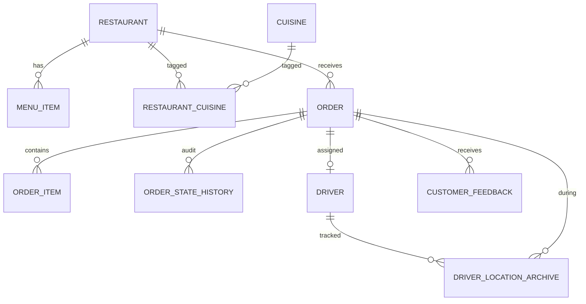
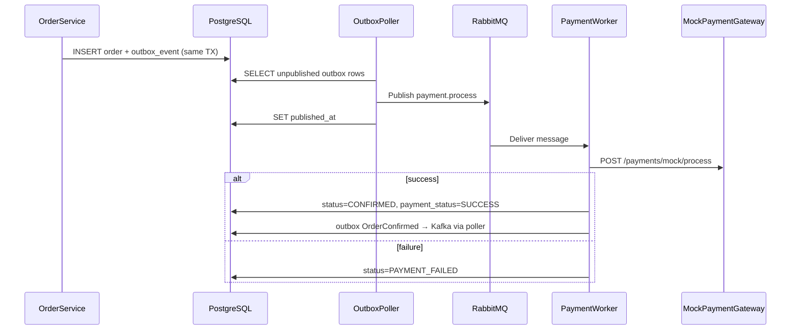
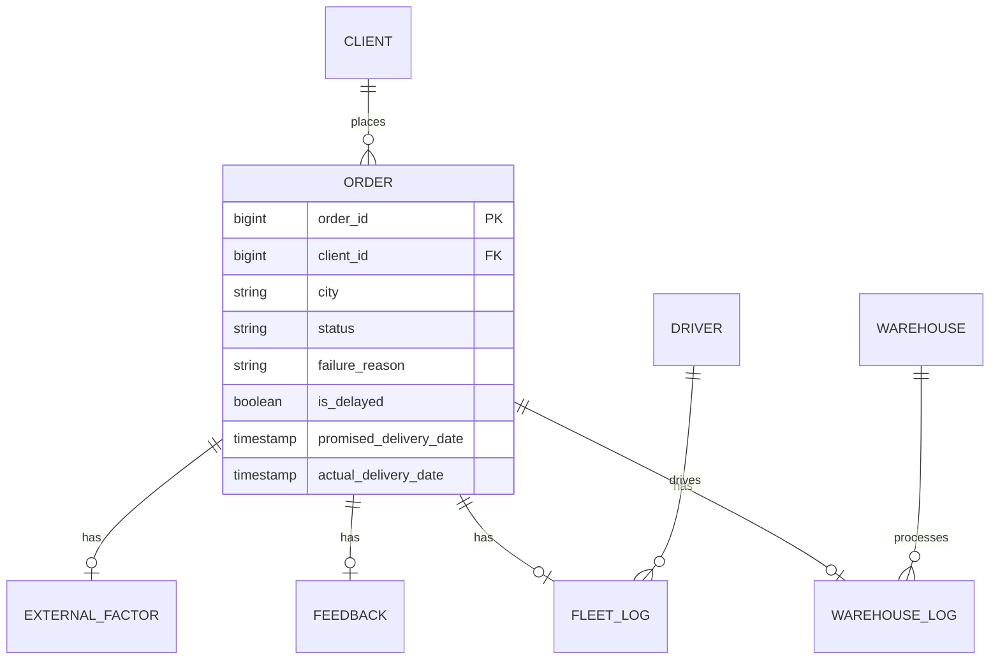
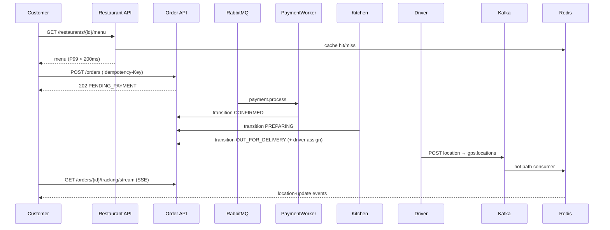

# SwiftEats — Low-Level Design (LLD)

Implementation-level design derived from [HIGH_LEVEL_DESIGN.md](./HIGH_LEVEL_DESIGN.md). Covers database schema, package structure, class responsibilities, message contracts, state machines, microservice deployment, and detailed flows for the **SwiftEats multi-service platform** (`platform-lib` + six Spring Boot services).

**Stack:** Java 17, Spring Boot 3.3.x, PostgreSQL 15, Redis 7, Kafka (KRaft), RabbitMQ  
**Deployment:** `docker-compose.yml` — six API services behind **backend-service :8080**

---

## Table of Contents

1. [Application Structure](#1-application-structure)
2. [Microservice Deployment](#2-microservice-deployment)
3. [Database Schema](#3-database-schema)
3. [JPA Entities](#4-jpa-entities)
4. [Restaurant Module](#5-restaurant-module)
5. [Order Module](#6-order-module)
6. [Tracking Module](#7-tracking-module)
7. [Refund Module](#8-refund-module)
8. [Analytics Module (Assignment 2)](#9-analytics-module-assignment-2)
9. [Common / Cross-Cutting](#10-common--cross-cutting)
10. [Redis Design](#11-redis-design)
11. [Kafka Design](#12-kafka-design)
12. [RabbitMQ Design](#13-rabbitmq-design)
13. [Detailed Flows](#14-detailed-flows)
14. [Error Model](#15-error-model)
15. [Configuration](#16-configuration)
16. [Migration Map (Old → New)](#17-migration-map-old--new)
17. [Testing Strategy](#18-testing-strategy)
18. [Sample Dataset Integration (Assignment 2)](#19-sample-dataset-integration-assignment-2)

---

## 1. Application Structure

### 1.1 Maven layout

```
services/
├── pom.xml                         # Parent reactor (swifteats-services)
├── platform-lib/                   # Shared JAR — all domain code
│   └── src/main/java/com/swifteats/
│       ├── auth/
│       ├── restaurant/
│       ├── order/                  # includes client/, controller/Internal*
│       ├── tracking/
│       ├── analytics/
│       ├── refund/
│       ├── gateway/
│       └── common/runtime/         # @ServiceScope, SwiftEatsServiceApplication
├── backend-service/                # Boot jar — BACKEND scope + gateway
├── entities-service/
├── order-service/
├── payment-service/
├── refund-service/
└── analytics-service/
```

Each boot module:

```java
@SwiftEatsServiceApplication
public class OrderServiceApplication {
    public static void main(String[] args) {
        System.setProperty("swifteats.service.name", "ORDER");
        SpringApplication.run(OrderServiceApplication.class, args);
    }
}
```

`@SwiftEatsServiceApplication` applies `@ComponentScan` with `ServiceScopeExcludeFilter` so only beans annotated for the active service (or unscoped shared beans) are loaded.

### 1.2 Legacy monolith (`swifteats-api/`)

The original single-JAR layout remains under `services/swifteats-api/` for reference. **docker-compose** uses the six-service stack instead.

### 1.3 Module boundary rules

| Rule | Enforcement |
|---|---|
| No cross-module repository access | `order` module calls `restaurant` via `RestaurantService` interface only |
| Shared infra in `common` | Redis/Kafka/RabbitMQ configs, exception handler, outbox |
| Events over direct DB reads | Analytics reads its own tables + Kafka; does not query `order` repositories directly at runtime |
| Package-private where possible | Internal services not exposed as Spring beans outside module |

| Cross-service order transition | `OrderInternalClient` → `POST /internal/v1/orders/{id}/transition` |
| Cross-service payment (no RabbitMQ) | `POST /internal/v1/payments/process` from order outbox fallback |

### 1.4 Spring Boot entry point

See `@SwiftEatsServiceApplication` in `platform-lib` — replaces the monolithic `SwiftEatsApplication`.

---

## 2. Microservice Deployment

| Service | Port | Flyway | Gateway routes proxied |
|---------|------|--------|------------------------|
| backend-service | 8080 | **enabled** | — (serves auth, public restaurants, tracking locally) |
| entities-service | 8081 | disabled | `/api/v1/admin/restaurants/**` |
| order-service | 8082 | disabled | `/api/v1/orders/**`, `/api/v1/admin/orders/**` (except `/tracking*`) |
| payment-service | 8083 | disabled | `/api/v1/payments/**` |
| refund-service | 8084 | disabled | `/api/v1/refunds/**` |
| analytics-service | 8085 | disabled | `/api/v1/analytics/**`, `/api/v1/admin/analytics/**` |

**Internal APIs** (service-to-service, not proxied by gateway):

| Method | Path | Caller | Purpose |
|--------|------|--------|---------|
| `POST` | `/internal/v1/orders/{orderId}/transition` | payment-service, refund-service | Apply order state change |
| `POST` | `/internal/v1/payments/process` | order-service (outbox fallback) | Synchronous payment when RabbitMQ disabled |
| `POST` | `/internal/v1/refunds/{refundId}/process` | refund-service (ops/debug) | Force refund processing |

**Unified Swagger:** `springdoc.swagger-ui.urls` on backend-service lists six specs; `OpenApiProxyController` fetches `/v3/api-docs` from each service.

**Docker build:**

```bash
docker build --build-arg SERVICE_MODULE=order-service -f services/Dockerfile services/
```

---

## 3. Database Schema

Flyway migrations in `resources/db/migration/`. All PKs are `UUID` (`gen_random_uuid()`).

### 2.1 ER diagram



> **Note:** Assignment 2 sample-data ER (CSV import, `analytics` schema) is in [§7.6](#76-join-model-correlation-hub).

### 2.2 DDL — Restaurant domain

```sql
-- V1__init.sql (excerpt)

CREATE TABLE cuisine (
    id          UUID PRIMARY KEY DEFAULT gen_random_uuid(),
    name        VARCHAR(100) NOT NULL UNIQUE
);

CREATE TABLE restaurant (
    id                  UUID PRIMARY KEY DEFAULT gen_random_uuid(),
    name                VARCHAR(255) NOT NULL,
    address             TEXT NOT NULL,
    city                VARCHAR(100) NOT NULL,
    rating              DECIMAL(2,1) DEFAULT 0.0,
    is_open             BOOLEAN NOT NULL DEFAULT false,
    estimated_wait_mins INTEGER DEFAULT 30,
    status              VARCHAR(20) NOT NULL DEFAULT 'ACTIVE',  -- PENDING, ACTIVE, SUSPENDED
    contact_email       VARCHAR(255),
    opening_time        TIME,
    closing_time        TIME,
    created_at          TIMESTAMPTZ NOT NULL DEFAULT now(),
    updated_at          TIMESTAMPTZ NOT NULL DEFAULT now(),
    version             BIGINT NOT NULL DEFAULT 0
);

CREATE INDEX idx_restaurant_city ON restaurant(city);
CREATE INDEX idx_restaurant_is_open ON restaurant(is_open);
CREATE INDEX idx_restaurant_name_trgm ON restaurant USING gin(name gin_trgm_ops);

CREATE TABLE restaurant_cuisine (
    restaurant_id UUID NOT NULL REFERENCES restaurant(id),
    cuisine_id    UUID NOT NULL REFERENCES cuisine(id),
    PRIMARY KEY (restaurant_id, cuisine_id)
);

CREATE TABLE menu_item (
    id            UUID PRIMARY KEY DEFAULT gen_random_uuid(),
    restaurant_id UUID NOT NULL REFERENCES restaurant(id),
    name          VARCHAR(255) NOT NULL,
    description   TEXT,
    category      VARCHAR(100) NOT NULL,
    price         DECIMAL(10,2) NOT NULL,
    available     BOOLEAN NOT NULL DEFAULT true,
    created_at    TIMESTAMPTZ NOT NULL DEFAULT now(),
    updated_at    TIMESTAMPTZ NOT NULL DEFAULT now()
);

CREATE INDEX idx_menu_item_restaurant ON menu_item(restaurant_id);
CREATE INDEX idx_menu_item_available ON menu_item(restaurant_id, available);
```

### 2.3 DDL — Order domain

```sql
CREATE TABLE customer (
    id         UUID PRIMARY KEY DEFAULT gen_random_uuid(),
    name       VARCHAR(255),
    email      VARCHAR(255),
    client_id  VARCHAR(100),          -- B2B client tag for Assignment 2
    created_at TIMESTAMPTZ NOT NULL DEFAULT now()
);

CREATE TABLE driver (
    id               UUID PRIMARY KEY DEFAULT gen_random_uuid(),
    name             VARCHAR(255) NOT NULL,
    phone            VARCHAR(20),
    status           VARCHAR(20) NOT NULL DEFAULT 'AVAILABLE',
    current_order_id UUID,
    created_at       TIMESTAMPTZ NOT NULL DEFAULT now()
);

CREATE TABLE "order" (
    id                  UUID PRIMARY KEY DEFAULT gen_random_uuid(),
    idempotency_key     VARCHAR(128) UNIQUE,
    customer_id         UUID NOT NULL REFERENCES customer(id),
    restaurant_id       UUID NOT NULL REFERENCES restaurant(id),
    driver_id           UUID REFERENCES driver(id),
    city                VARCHAR(100) NOT NULL,
    status              VARCHAR(30) NOT NULL,
    payment_status      VARCHAR(20) NOT NULL DEFAULT 'PENDING',
    total_amount        DECIMAL(10,2) NOT NULL,
    delivery_address    TEXT NOT NULL,
    failure_reason      VARCHAR(50),
    delay_reason        VARCHAR(50),
    prep_started_at     TIMESTAMPTZ,
    prep_completed_at   TIMESTAMPTZ,
    out_for_delivery_at TIMESTAMPTZ,
    delivered_at        TIMESTAMPTZ,
    created_at          TIMESTAMPTZ NOT NULL DEFAULT now(),
    updated_at          TIMESTAMPTZ NOT NULL DEFAULT now(),
    version             BIGINT NOT NULL DEFAULT 0
);

CREATE INDEX idx_order_customer ON "order"(customer_id);
CREATE INDEX idx_order_restaurant ON "order"(restaurant_id);
CREATE INDEX idx_order_status ON "order"(status);
CREATE INDEX idx_order_city_created ON "order"(city, created_at);
CREATE INDEX idx_order_idempotency ON "order"(idempotency_key);

CREATE TABLE order_item (
    id            UUID PRIMARY KEY DEFAULT gen_random_uuid(),
    order_id      UUID NOT NULL REFERENCES "order"(id),
    menu_item_id  UUID NOT NULL REFERENCES menu_item(id),
    name          VARCHAR(255) NOT NULL,   -- denormalized snapshot
    quantity      INTEGER NOT NULL,
    unit_price    DECIMAL(10,2) NOT NULL,
    line_total    DECIMAL(10,2) NOT NULL
);

CREATE TABLE order_state_history (
    id          UUID PRIMARY KEY DEFAULT gen_random_uuid(),
    order_id    UUID NOT NULL REFERENCES "order"(id),
    from_status VARCHAR(30),
    to_status   VARCHAR(30) NOT NULL,
    changed_by  VARCHAR(100),
    reason      VARCHAR(50),
    notes       TEXT,
    changed_at  TIMESTAMPTZ NOT NULL DEFAULT now()
);

CREATE INDEX idx_order_history_order ON order_state_history(order_id, changed_at);
```

### 2.4 DDL — Tracking (operational)

```sql
CREATE TABLE driver_location_archive (
    id         BIGSERIAL PRIMARY KEY,
    driver_id  UUID NOT NULL,
    order_id   UUID,
    latitude   DECIMAL(10,7) NOT NULL,
    longitude  DECIMAL(10,7) NOT NULL,
    heading    DECIMAL(5,2),
    recorded_at TIMESTAMPTZ NOT NULL
);

CREATE INDEX idx_gps_archive_driver_time ON driver_location_archive(driver_id, recorded_at);
CREATE INDEX idx_gps_archive_order ON driver_location_archive(order_id);
```

### 2.5 DDL — Live feedback & outbox

```sql
CREATE TABLE customer_feedback (
    id          UUID PRIMARY KEY DEFAULT gen_random_uuid(),
    order_id    UUID NOT NULL REFERENCES "order"(id),
    customer_id UUID NOT NULL,
    text        TEXT NOT NULL,
    sentiment   VARCHAR(20),
    rating      INTEGER,
    created_at  TIMESTAMPTZ NOT NULL DEFAULT now()
);

CREATE TABLE outbox_event (
    id           UUID PRIMARY KEY DEFAULT gen_random_uuid(),
    aggregate_type VARCHAR(50) NOT NULL,
    aggregate_id   UUID NOT NULL,
    event_type     VARCHAR(100) NOT NULL,
    payload        JSONB NOT NULL,
    created_at     TIMESTAMPTZ NOT NULL DEFAULT now(),
    published_at   TIMESTAMPTZ
);

CREATE INDEX idx_outbox_unpublished ON outbox_event(published_at) WHERE published_at IS NULL;
```

### 2.6 DDL — Analytics sample dataset (Assignment 2)

Mirrors CSV files in `third-assignment-sample-data-set/` **exactly**. Uses `BIGINT` IDs as in the source files. Populated via `SampleDataImportService`. Stored in PostgreSQL schema `analytics` — separate from live SwiftEats UUID tables.

```sql
CREATE SCHEMA IF NOT EXISTS analytics;

-- clients.csv (~748 rows)
CREATE TABLE analytics.client (
    client_id       BIGINT PRIMARY KEY,
    client_name     VARCHAR(255) NOT NULL,
    gst_number      VARCHAR(20),
    contact_person  VARCHAR(255),
    contact_phone   VARCHAR(30),
    contact_email   VARCHAR(255),
    address_line1   TEXT,
    address_line2   TEXT,
    city            VARCHAR(100),
    state           VARCHAR(100),
    pincode         VARCHAR(10),
    created_at      TIMESTAMPTZ
);

-- warehouses.csv (~50 rows) — maps to Restaurant/kitchen in SwiftEats
CREATE TABLE analytics.warehouse (
    warehouse_id    BIGINT PRIMARY KEY,
    warehouse_name  VARCHAR(100) NOT NULL,
    state           VARCHAR(100),
    city            VARCHAR(100),
    pincode         VARCHAR(10),
    capacity        INTEGER,
    manager_name    VARCHAR(255),
    contact_phone   VARCHAR(30),
    created_at      TIMESTAMPTZ
);

-- drivers.csv (~2,000 rows)
CREATE TABLE analytics.driver (
    driver_id       BIGINT PRIMARY KEY,
    driver_name     VARCHAR(255),
    phone           VARCHAR(30),
    license_number  VARCHAR(20),
    partner_company VARCHAR(50),
    city            VARCHAR(100),
    state           VARCHAR(100),
    status          VARCHAR(20),
    created_at      TIMESTAMPTZ
);

-- orders.csv (~14,947 rows) — central join hub
CREATE TABLE analytics."order" (
    order_id                BIGINT PRIMARY KEY,
    client_id               BIGINT REFERENCES analytics.client(client_id),
    customer_name           VARCHAR(255),
    customer_phone          VARCHAR(30),
    delivery_address_line1  TEXT,
    delivery_address_line2  TEXT,
    city                    VARCHAR(100) NOT NULL,
    state                   VARCHAR(100),
    pincode                 VARCHAR(10),
    order_date              TIMESTAMPTZ,
    promised_delivery_date  TIMESTAMPTZ,
    actual_delivery_date    TIMESTAMPTZ,
    status                  VARCHAR(20) NOT NULL,
    payment_mode            VARCHAR(20),
    amount                  DECIMAL(12,2),
    failure_reason          VARCHAR(50),
    created_at              TIMESTAMPTZ,
    is_delayed              BOOLEAN,
    is_failed               BOOLEAN
);

CREATE INDEX idx_sample_order_city ON analytics."order"(city);
CREATE INDEX idx_sample_order_client ON analytics."order"(client_id);
CREATE INDEX idx_sample_order_status ON analytics."order"(status);
CREATE INDEX idx_sample_order_dates ON analytics."order"(order_date);
CREATE INDEX idx_sample_order_failure ON analytics."order"(failure_reason) WHERE failure_reason IS NOT NULL;

-- warehouse_logs.csv (~10,000 rows)
CREATE TABLE analytics.warehouse_log (
    log_id          BIGINT PRIMARY KEY,
    order_id        BIGINT NOT NULL REFERENCES analytics."order"(order_id),
    warehouse_id    BIGINT NOT NULL REFERENCES analytics.warehouse(warehouse_id),
    picking_start   TIMESTAMPTZ,
    picking_end     TIMESTAMPTZ,
    dispatch_time   TIMESTAMPTZ,
    notes           VARCHAR(100)
);

CREATE INDEX idx_wh_log_order ON analytics.warehouse_log(order_id);
CREATE INDEX idx_wh_log_warehouse ON analytics.warehouse_log(warehouse_id);

-- fleet_logs.csv (~10,000 rows)
CREATE TABLE analytics.fleet_log (
    fleet_log_id    BIGINT PRIMARY KEY,
    order_id        BIGINT NOT NULL REFERENCES analytics."order"(order_id),
    driver_id       BIGINT REFERENCES analytics.driver(driver_id),
    vehicle_number  VARCHAR(20),
    route_code      VARCHAR(20),
    gps_delay_notes VARCHAR(100),
    departure_time  TIMESTAMPTZ,
    arrival_time    TIMESTAMPTZ,
    created_at      TIMESTAMPTZ
);

CREATE INDEX idx_fleet_log_order ON analytics.fleet_log(order_id);

-- feedback.csv (~10,000 rows)
CREATE TABLE analytics.feedback (
    feedback_id     BIGINT PRIMARY KEY,
    order_id        BIGINT NOT NULL REFERENCES analytics."order"(order_id),
    customer_name   VARCHAR(255),
    feedback_text   TEXT,
    sentiment       VARCHAR(20),
    rating          INTEGER,
    created_at      TIMESTAMPTZ
);

-- external_factors.csv (~10,000 rows) — per-order context
CREATE TABLE analytics.external_factor (
    factor_id           BIGINT PRIMARY KEY,
    order_id            BIGINT NOT NULL REFERENCES analytics."order"(order_id),
    traffic_condition   VARCHAR(20),
    weather_condition   VARCHAR(20),
    event_type          VARCHAR(20),
    recorded_at         TIMESTAMPTZ
);

CREATE INDEX idx_ext_factor_order ON analytics.external_factor(order_id);
CREATE INDEX idx_ext_factor_event ON analytics.external_factor(event_type);

CREATE TABLE analytics.delivery_insight (
    id              UUID PRIMARY KEY DEFAULT gen_random_uuid(),
    query_type      VARCHAR(50) NOT NULL,
    parameters      JSONB NOT NULL,
    narrative       TEXT NOT NULL,
    recommendations JSONB,
    evidence        JSONB,
    generated_at    TIMESTAMPTZ NOT NULL DEFAULT now()
);
```

**Flyway:** `V2__analytics_schema.sql`

---

## 3. JPA Entities

### 3.1 Restaurant module entities

```java
@Entity @Table(name = "restaurant")
public class Restaurant {
    @Id @GeneratedValue private UUID id;
    private String name, address, city;
    private BigDecimal rating;
    private boolean isOpen;
    private int estimatedWaitMins;
    @Enumerated(STRING) private RestaurantStatus status;
    private LocalTime openingTime, closingTime;
    @Version private Long version;
    @OneToMany(mappedBy = "restaurant") private List<MenuItem> menuItems;
}

@Entity @Table(name = "menu_item")
public class MenuItem {
    @Id @GeneratedValue private UUID id;
    @ManyToOne @JoinColumn(name = "restaurant_id") private Restaurant restaurant;
    private String name, description, category;
    private BigDecimal price;
    private boolean available;
}
```

### 3.2 Order module entities

```java
@Entity @Table(name = "\"order\"")
public class Order {
    @Id @GeneratedValue private UUID id;
    private String idempotencyKey;
    private UUID customerId, restaurantId, driverId;
    private String city, deliveryAddress;
    @Enumerated(STRING) private OrderStatus status;
    @Enumerated(STRING) private PaymentStatus paymentStatus;
    private BigDecimal totalAmount;
    @Enumerated(STRING) private FailureReason failureReason;
    @Enumerated(STRING) private DelayReason delayReason;
    private Instant prepStartedAt, prepCompletedAt, outForDeliveryAt, deliveredAt;
    @Version private Long version;
    @OneToMany(mappedBy = "order", cascade = ALL) private List<OrderItem> items;
}
```

### 3.3 Enums

```java
public enum OrderStatus {
    PENDING_PAYMENT, CONFIRMED, PREPARING, OUT_FOR_DELIVERY,
    DELIVERED, PAYMENT_FAILED, DELAYED, FAILED, CANCELLED
}

public enum PaymentStatus { PENDING, SUCCESS, FAILED }

public enum FailureReason {
    // SwiftEats live platform enums
    PAYMENT_FAILED, LATE_PREPARATION, DRIVER_UNAVAILABLE,
    ADDRESS_NOT_FOUND, CUSTOMER_UNREACHABLE, OTHER,
    // Sample CSV values (analytics import — orders.failure_reason)
    STOCKOUT, WAREHOUSE_DELAY, TRAFFIC_CONGESTION,
    INCORRECT_ADDRESS, WEATHER_DISRUPTION
}

public enum DelayReason {
    TRAFFIC, WEATHER, KITCHEN_BACKLOG, HIGH_DEMAND, OTHER
}

public enum DriverStatus { AVAILABLE, ON_DELIVERY, OFFLINE }

public enum RestaurantStatus { PENDING, ACTIVE, SUSPENDED }
```

---

## 4. Restaurant Module

### 4.0 Temporary data naming

Seed rows (Flyway V4–V6) and runtime creates/updates prefix display names with **`[T] `** via `com.swifteats.common.domain.TemporaryDataLabels` in `RestaurantService` and `CustomerAuthService`. Applies to restaurants, menu items, auto-created cuisines, customers, and drivers. Search still matches partial names (e.g. `Misal` finds `[T] Misal House`).

### 4.1 Classes and responsibilities

| Class | Responsibility |
|---|---|
| `RestaurantController` | Public read APIs: list, search, menu |
| `AdminRestaurantController` | Onboarding CRUD under `/admin/*` |
| `RestaurantService` | Business logic, search queries, cache invalidation |
| `MenuCacheService` | Redis cache-aside read/write/invalidate |
| `RestaurantMapper` | Entity ↔ DTO |
| `KitchenEventProducer` | Publish `kitchen.events` to Kafka |

### 4.2 Public API contracts

#### `GET /api/v1/restaurants`

**Query params:**

| Param | Type | Default | Description |
|---|---|---|---|
| `city` | string | — | Exact match |
| `cuisine` | string | — | Cuisine name |
| `isOpen` | boolean | — | Filter open restaurants |
| `minRating` | decimal | — | Minimum rating |
| `name` | string | — | Partial name search |
| `page` | int | 0 | Page index |
| `size` | int | 20 | Page size |

**Response `200`:**

```json
{
  "content": [
    {
      "id": "uuid",
      "name": "[T] Misal House",
      "city": "Pune",
      "rating": 4.5,
      "isOpen": true,
      "cuisines": ["[T] Maharashtrian", "[T] Street Food"],
      "estimatedWaitMins": 25
    }
  ],
  "page": 0,
  "size": 20,
  "totalElements": 142
}
```

#### `GET /api/v1/restaurants/{id}/menu` — P99 critical path

**Response `200` (`RestaurantMenuResponse`):**

```json
{
  "restaurantId": "uuid",
  "name": "[T] Misal House",
  "isOpen": true,
  "estimatedWaitMins": 25,
  "menuItems": [
    {
      "id": "uuid",
      "name": "[T] Kolhapuri Misal",
      "category": "Main",
      "price": 120.00,
      "available": true
    }
  ],
  "cachedAt": "2026-08-21T18:00:00Z"
}
```

**Implementation (`MenuCacheService.getMenu`):**

```java
public RestaurantMenuResponse getMenu(UUID restaurantId) {
    String key = "restaurant:" + restaurantId + ":menu";
    String cached = redisTemplate.opsForValue().get(key);
    if (cached != null) return objectMapper.readValue(cached, RestaurantMenuResponse.class);

    RestaurantMenuResponse response = restaurantRepository.loadMenuWithStatus(restaurantId);
    redisTemplate.opsForValue().set(key, objectMapper.writeValueAsString(response),
        Duration.ofMinutes(10));
    return response;
}
```

**Cache invalidation triggers:**

| Event | Action |
|---|---|
| Admin updates menu item | `DELETE restaurant:{id}:menu` |
| Admin toggles `isOpen` | `DELETE restaurant:{id}:menu` + list cache keys by pattern |
| Menu item stockout | `DELETE restaurant:{id}:menu` + publish `MenuItemStockout` |

### 4.3 Admin onboarding API contracts

#### `POST /api/v1/admin/restaurants`

**Headers:** `X-Admin-Api-Key: {key}`

**Request:**

```json
{
  "name": "Pune Biryani Co",
  "address": "FC Road, Pune",
  "city": "Pune",
  "cuisines": ["Biryani", "Mughlai"],
  "contactEmail": "owner@example.com",
  "openingTime": "10:00",
  "closingTime": "23:00"
}
```

**Response `201`:** Created restaurant with `status: PENDING` and stored name `[T] Pune Biryani Co` (auto-prefixed by `TemporaryDataLabels`).

#### `PATCH /api/v1/admin/restaurants/{id}/approve`

Sets `status: ACTIVE`, `isOpen: true`, invalidates cache.

### 4.4 Search query (repository)

```java
@Query("""
    SELECT r FROM Restaurant r
    JOIN r.cuisines c
    WHERE (:city IS NULL OR r.city = :city)
      AND (:cuisine IS NULL OR c.name = :cuisine)
      AND (:isOpen IS NULL OR r.isOpen = :isOpen)
      AND (:minRating IS NULL OR r.rating >= :minRating)
      AND (:name IS NULL OR LOWER(r.name) LIKE LOWER(CONCAT('%', :name, '%')))
      AND r.status = 'ACTIVE'
    """)
Page<Restaurant> search(..., Pageable pageable);
```

---

## 5. Order Module

### 5.1 State machine

Port pattern from `OrderService.VALID_TRANSITIONS` in orders-returns-mgmt-service.

```java
@Component
public class OrderStateMachine {

    private static final Map<OrderStatus, Set<OrderStatus>> TRANSITIONS = Map.of(
        PENDING_PAYMENT, Set.of(CONFIRMED, PAYMENT_FAILED, CANCELLED),
        CONFIRMED,       Set.of(PREPARING, CANCELLED),
        PREPARING,       Set.of(OUT_FOR_DELIVERY, DELAYED, FAILED, CANCELLED),
        DELAYED,         Set.of(PREPARING, OUT_FOR_DELIVERY, FAILED, CANCELLED),
        OUT_FOR_DELIVERY,Set.of(DELIVERED, FAILED),
        PAYMENT_FAILED,  Set.of(),   // terminal
        DELIVERED,       Set.of(),   // terminal
        FAILED,          Set.of(),   // terminal
        CANCELLED,       Set.of()    // terminal
    );

    public void validate(OrderStatus from, OrderStatus to) {
        if (!TRANSITIONS.getOrDefault(from, Set.of()).contains(to))
            throw new InvalidStateTransitionException(from, to);
    }
}
```

### 5.2 State transition side effects

| Transition | Side effects |
|---|---|
| → `CONFIRMED` | `paymentStatus = SUCCESS`; publish `OrderConfirmed` |
| → `PREPARING` | Set `prepStartedAt`; publish `KitchenPrepStarted` |
| → `OUT_FOR_DELIVERY` | Set `prepCompletedAt`, `outForDeliveryAt`; assign driver |
| → `DELIVERED` | Set `deliveredAt`; driver status → `AVAILABLE` |
| → `FAILED` | Set `failureReason`; publish `OrderFailed` |
| → `DELAYED` | Set `delayReason`; publish `OrderDelayed` |
| → `PAYMENT_FAILED` | Publish `OrderFailed`; schedule cancel compensation |

All transitions write to `order_state_history`.

### 5.3 `POST /api/v1/orders` — create order

**Headers:**

| Header | Required | Description |
|---|---|---|
| `Idempotency-Key` | Yes | Client-generated UUID or unique string |
| `Content-Type` | Yes | `application/json` |

**Request (`CreateOrderRequest`):**

```json
{
  "customerId": "uuid",
  "restaurantId": "uuid",
  "deliveryAddress": "123 MG Road, Pune",
  "items": [
    { "menuItemId": "uuid", "quantity": 2 }
  ]
}
```

**Processing steps (`OrderService.createOrder`):**

```
1. Check idempotency_key in DB → return existing order if found
2. Validate restaurant ACTIVE + isOpen (RestaurantService)
3. Validate menu items exist + available; snapshot names/prices
4. Calculate totalAmount
5. BEGIN TRANSACTION
   a. INSERT order (status=PENDING_PAYMENT, payment_status=PENDING)
   b. INSERT order_items
   c. INSERT outbox_event (OrderCreated)
6. COMMIT
7. Return 202 Accepted { orderId, status, paymentStatus }
```

**Response `202`:**

```json
{
  "orderId": "uuid",
  "status": "PENDING_PAYMENT",
  "paymentStatus": "PENDING",
  "totalAmount": 240.00,
  "message": "Order accepted; payment processing asynchronously"
}
```

### 5.4 Async payment — Outbox + RabbitMQ

**Why both Outbox and RabbitMQ?**

- **Outbox** guarantees atomicity: order row + event in same DB transaction
- **RabbitMQ** decouples payment worker from API thread; supports retry/DLQ



**Outbox poller (`@Scheduled(fixedDelay = 1000)`):**

```java
@Transactional
public void pollAndPublish() {
    List<OutboxEvent> batch = outboxRepository.findUnpublished(PageRequest.of(0, 100));
    for (OutboxEvent event : batch) {
        if ("PaymentProcess".equals(event.getEventType()))
            rabbitTemplate.convertAndSend("payment.exchange", "payment.process", event.getPayload());
        else
            kafkaTemplate.send(resolveTopic(event), event.getAggregateId().toString(), event.getPayload());
        event.setPublishedAt(Instant.now());
    }
}
```

### 5.5 Payment worker

```java
@RabbitListener(queues = "payment.process.queue")
public void processPayment(PaymentProcessMessage msg) {
    Order order = orderRepository.findById(msg.orderId()).orElseThrow();

    try {
        PaymentResult result = paymentGatewayClient.charge(
            order.getId(), order.getTotalAmount());  // Resilience4j circuit breaker
        if (result.success())
            orderInternalClient.transition(message.orderId(), CONFIRMED, "PAYMENT_WORKER", null);
        else
            orderService.transition(order.getId(), PAYMENT_FAILED, "PAYMENT_WORKER");
    } catch (Exception ex) {
        throw new AmqpRejectAndDontRequeueException(ex); // → DLQ after max retries
    }
}
```

**Mock payment gateway (`MockPaymentController`):**

```java
@PostMapping("/api/v1/payments/mock/process")
public PaymentResult process(@RequestBody PaymentRequest req) {
    // Configurable failure rate: swifteats.payment.mock.failure-rate=0.1
    // Configurable latency: swifteats.payment.mock.delay-ms=200
}
```

### 5.6 Idempotency

```java
public Order createOrder(String idempotencyKey, CreateOrderRequest req) {
    return orderRepository.findByIdempotencyKey(idempotencyKey)
        .map(existing -> existing)
        .orElseGet(() -> doCreate(idempotencyKey, req));
}
```

Unique index on `idempotency_key` prevents race duplicates; optimistic lock on concurrent updates.

---

## 6. Tracking Module

### 6.1 Classes

| Class | Responsibility |
|---|---|
| `DriverLocationController` | `POST /drivers/{id}/location` — validate, publish to Kafka, return 202 |
| `GpsHotPathConsumer` | Kafka → Redis SET + PUBLISH |
| `GpsArchiveConsumer` | Sampled write to `driver_location_archive` |
| `TrackingController` | REST snapshot + SSE stream |
| `SseTrackingService` | Manage `SseEmitter` lifecycle, Redis Pub/Sub subscription |

### 6.2 GPS ingest API

#### `POST /api/v1/drivers/{driverId}/location`

**Request:**

```json
{
  "latitude": 18.5204,
  "longitude": 73.8567,
  "heading": 135.0,
  "timestamp": "2026-08-21T18:05:00Z",
  "orderId": "uuid"
}
```

**Processing:**

```java
public void ingest(UUID driverId, LocationUpdateRequest req) {
    GpsLocationEvent event = new GpsLocationEvent(driverId, req);
    kafkaTemplate.send("gps.locations", driverId.toString(), event);  // partition key = driverId
}
```

**Response `202`:** `{ "accepted": true }` — no DB write on request thread.

### 6.3 Hot path consumer

```java
@KafkaListener(topics = "gps.locations", groupId = "gps-hot-path")
public void consume(GpsLocationEvent event) {
    String key = "driver:" + event.driverId() + ":location";
    redisTemplate.opsForValue().set(key, serialize(event), Duration.ofMinutes(30));
    redisTemplate.convertAndSend("channel:driver:" + event.driverId(), serialize(event));
}
```

### 6.4 Cold path archiver (sampled)

```java
@KafkaListener(topics = "gps.locations", groupId = "gps-archive")
public void archive(GpsLocationEvent event) {
    // Sample: every 30s per driver OR when orderId present on every 5th event
    if (sampler.shouldArchive(event.driverId())) {
        archiveRepository.save(toEntity(event));
    }
}
```

Local config: `swifteats.tracking.archive.sample-interval-sec=30`

### 6.5 SSE tracking stream

#### `GET /api/v1/orders/{orderId}/tracking/stream`

```java
@GetMapping(value = "/{orderId}/tracking/stream", produces = TEXT_EVENT_STREAM_VALUE)
public SseEmitter stream(@PathVariable UUID orderId) {
    Order order = orderService.getOrder(orderId);
    UUID driverId = requireAssignedDriver(order);

    SseEmitter emitter = new SseEmitter(300_000L); // 5 min timeout
    sseTrackingService.subscribe(orderId, driverId, emitter);
    return emitter;
}
```

**`SseTrackingService` logic:**

```
1. Register emitter in ConcurrentHashMap<orderId, SseEmitter>
2. Subscribe to Redis channel "channel:driver:{driverId}"
3. On message → emitter.send(SseEvent.builder().name("location-update").data(payload))
4. On client disconnect → unsubscribe, remove from map
5. Heartbeat every 15s: event "ping"
```

**SSE event format:**

```
event: location-update
data: {"driverId":"...","latitude":18.52,"longitude":73.85,"timestamp":"..."}

event: ping
data: {}
```

#### `GET /api/v1/orders/{orderId}/tracking` — REST snapshot

Reads `driver:{driverId}:location` from Redis; returns 404 if order not yet assigned.

---

## 7. Refund Module (refund-service)

### 7.1 DDL — Refunds (`V9__refunds.sql`)

```sql
CREATE TABLE refund (
    id              UUID PRIMARY KEY DEFAULT gen_random_uuid(),
    order_id        UUID NOT NULL REFERENCES "order"(id),
    customer_id     UUID NOT NULL,
    amount          NUMERIC(12, 2) NOT NULL,
    status          VARCHAR(32) NOT NULL,  -- INITIATED, PROCESSING, SUCCESSFUL, FAILED
    reason          TEXT,
    failure_reason  TEXT,
    idempotency_key VARCHAR(128) UNIQUE,
    created_at      TIMESTAMPTZ NOT NULL DEFAULT NOW(),
    updated_at      TIMESTAMPTZ NOT NULL DEFAULT NOW(),
    completed_at    TIMESTAMPTZ
);
```

### 7.2 Refund status flow

```
INITIATED → PROCESSING → SUCCESSFUL
                      └→ FAILED
```

On `SUCCESSFUL`: `OrderInternalClient.transition(orderId, RETURNED, "REFUND_WORKER", reason)`.

Eligible order statuses: `DELIVERED`, `CANCELLED`, `PAYMENT_FAILED`, `FAILED`.

### 7.3 External API

| Method | Path | Notes |
|--------|------|-------|
| `POST` | `/api/v1/refunds` | Requires `Idempotency-Key`; body `{ orderId, reason? }` |
| `GET` | `/api/v1/refunds` | Customer's refunds |
| `GET` | `/api/v1/refunds/{refundId}` | Refund detail |

### 7.4 Classes

| Class | Responsibility |
|-------|----------------|
| `RefundController` | External REST |
| `RefundService` | Validation, persistence, orchestration |
| `RefundWorker` | Async processing after initiation |
| `RefundProcessingService` | Mock gateway (configurable failure rate) |
| `HttpOrderInternalClient` | Calls order-service on success |

---

## 8. Analytics Module (Assignment 2)

### 7.1 Data source strategy

| Source | When used | Schema |
|---|---|---|
| **Sample CSV import** | Assignment 2 demo, CLI, insight APIs | `analytics.*` tables (BIGINT IDs, mirrors CSV) |
| **Live SwiftEats platform** | Future — Kafka consumers populate parallel structures | Public schema (UUID IDs) |

Assignment 2 demo primarily runs against **imported sample data**. The correlation engine joins all domains on `analytics.order.order_id`.

### 7.2 Sample dataset inventory

Location: `third-assignment-sample-data-set/`

| CSV file | Rows | Table | Join key |
|---|---|---|---|
| `orders.csv` | ~14,947 | `analytics.order` | **Primary hub** |
| `clients.csv` | ~748 | `analytics.client` | `order.client_id` |
| `warehouses.csv` | ~50 | `analytics.warehouse` | `warehouse_log.warehouse_id` |
| `drivers.csv` | ~2,000 | `analytics.driver` | `fleet_log.driver_id` |
| `warehouse_logs.csv` | ~10,000 | `analytics.warehouse_log` | `order_id` |
| `fleet_logs.csv` | ~10,000 | `analytics.fleet_log` | `order_id` |
| `feedback.csv` | ~10,000 | `analytics.feedback` | `order_id` |
| `external_factors.csv` | ~10,000 | `analytics.external_factor` | `order_id` |

### 7.3 CSV column → table mapping

#### `orders.csv`

| CSV column | DB column | Notes |
|---|---|---|
| `order_id` | `order_id` | PK |
| `client_id` | `client_id` | FK → client |
| `customer_name` | `customer_name` | |
| `customer_phone` | `customer_phone` | |
| `delivery_address_line1/2` | `delivery_address_line1/2` | |
| `city`, `state`, `pincode` | same | Filter dimension |
| `order_date` | `order_date` | |
| `promised_delivery_date` | `promised_delivery_date` | SLA target |
| `actual_delivery_date` | `actual_delivery_date` | NULL if undelivered |
| `status` | `status` | Failed, Delivered, Pending, In-Transit, Returned |
| `payment_mode` | `payment_mode` | COD, Prepaid |
| `amount` | `amount` | |
| `failure_reason` | `failure_reason` | Only when status=Failed |
| `created_at` | `created_at` | |

**Derived on import:**

```java
order.setFailed("Failed".equalsIgnoreCase(row.getStatus()));
order.setDelayed(
    row.getActualDeliveryDate() != null
    && row.getPromisedDeliveryDate() != null
    && row.getActualDeliveryDate().isAfter(row.getPromisedDeliveryDate())
);
```

#### `warehouse_logs.csv`

| CSV column | DB column |
|---|---|
| `log_id` | `log_id` |
| `order_id` | `order_id` |
| `warehouse_id` | `warehouse_id` |
| `picking_start/end` | `picking_start`, `picking_end` |
| `dispatch_time` | `dispatch_time` |
| `notes` | `notes` — `Stock delay on item`, `Slow packing`, `System issue`, or empty |

**Derived metrics:**

```java
Duration pickDuration = Duration.between(pickingStart, pickingEnd);
Duration dispatchLag = Duration.between(pickingEnd, dispatchTime);
boolean hasStockDelay = notes != null && notes.contains("Stock delay");
```

#### `fleet_logs.csv`

| CSV column | DB column |
|---|---|
| `fleet_log_id` | `fleet_log_id` |
| `order_id` | `order_id` |
| `driver_id` | `driver_id` |
| `vehicle_number` | `vehicle_number` |
| `route_code` | `route_code` |
| `gps_delay_notes` | `gps_delay_notes` — `Address not found`, `Heavy congestion`, `Breakdown`, or empty |
| `departure_time/arrival_time` | same |

#### `external_factors.csv`

| CSV column | DB column | Sample values |
|---|---|---|
| `factor_id` | `factor_id` | |
| `order_id` | `order_id` | |
| `traffic_condition` | `traffic_condition` | Clear, Moderate, Heavy |
| `weather_condition` | `weather_condition` | Clear, Rain, Fog |
| `event_type` | `event_type` | Strike, Holiday, Festival, or empty |
| `recorded_at` | `recorded_at` | |

#### `feedback.csv`

| CSV column | DB column | Sample values |
|---|---|---|
| `feedback_id` | `feedback_id` | |
| `order_id` | `order_id` | |
| `customer_name` | `customer_name` | |
| `feedback_text` | `feedback_text` | Unstructured complaint text |
| `sentiment` | `sentiment` | Negative, Positive, Neutral |
| `rating` | `rating` | 1–5 |

### 7.4 Observed data distributions (import validation)

Use these counts to sanity-check import and unit tests:

| Dimension | Values (approx.) |
|---|---|
| **Order status** | Failed 2004, Delivered 1942, Pending 2111, In-Transit 2011, Returned 1932 |
| **Failure reasons** | Stockout 425, Warehouse delay 422, Traffic congestion 363, Incorrect address 409, Weather disruption 385 |
| **Top cities** | New Delhi 2002, Ahmedabad 1023, Coimbatore 1021, Mysuru 1021, Bengaluru 997, Pune 650, Mumbai 673 |
| **Fleet gps_delay_notes** | Heavy congestion 2625, Address not found 2442, Breakdown 2467, empty 2466 |
| **Warehouse notes** | Stock delay 2482, Slow packing 2415, System issue 2497, empty 2606 |
| **Traffic** | Clear 3348, Moderate 3317, Heavy 3335 |
| **Weather** | Fog 3408, Rain 3289, Clear 3303 |
| **Event type** | Holiday 2575, Festival 2512, Strike 2374, empty 2539 |
| **Feedback sentiment** | Neutral 3403, Negative 3322, Positive 3275 |

### 7.5 SwiftEats ↔ sample data domain mapping

| Sample dataset | SwiftEats platform (Assignment 1) |
|---|---|
| `analytics.warehouse` | `restaurant` table |
| `warehouse_logs` | Kitchen prep events (`prepStartedAt`, `prepCompletedAt`, stockout) |
| `fleet_logs` | `driver_location_archive` + `gps_delay_notes` field on fleet log |
| `external_factors` | Per-order context (live: from Kafka; demo: CSV import) |
| `clients` | B2B `client_id` on orders |
| `orders.failure_reason` | `order.failure_reason` (enum mapping below) |

**Failure reason mapping (CSV → SwiftEats enum):**

| CSV `failure_reason` | SwiftEats enum | Correlates with |
|---|---|---|
| Stockout | `STOCKOUT` | warehouse `Stock delay on item` |
| Warehouse delay | `WAREHOUSE_DELAY` | warehouse `Slow packing`, `System issue` |
| Traffic congestion | `TRAFFIC_CONGESTION` | fleet `Heavy congestion`, traffic `Heavy` |
| Incorrect address | `INCORRECT_ADDRESS` | fleet `Address not found`, feedback "wrong address" |
| Weather disruption | `WEATHER_DISRUPTION` | weather `Rain`/`Fog` |

### 7.6 Join model (correlation hub)



**Master correlation query (enriched order view):**

```sql
SELECT o.order_id, o.city, o.status, o.failure_reason, o.is_delayed,
       o.client_id, c.client_name,
       w.warehouse_id, w.warehouse_name, w.city AS warehouse_city,
       wl.notes AS warehouse_notes,
       wl.dispatch_time - wl.picking_end AS dispatch_lag,
       fl.gps_delay_notes, fl.driver_id,
       ef.traffic_condition, ef.weather_condition, ef.event_type,
       fb.feedback_text, fb.sentiment
FROM analytics."order" o
LEFT JOIN analytics.client c         ON c.client_id = o.client_id
LEFT JOIN analytics.warehouse_log wl ON wl.order_id = o.order_id
LEFT JOIN analytics.warehouse w      ON w.warehouse_id = wl.warehouse_id
LEFT JOIN analytics.fleet_log fl     ON fl.order_id = o.order_id
LEFT JOIN analytics.external_factor ef ON ef.order_id = o.order_id
LEFT JOIN analytics.feedback fb      ON fb.order_id = o.order_id;
```

### 7.7 Sample data import service

```java
@Service
@ConditionalOnProperty("swifteats.analytics.import-on-startup")
public class SampleDataImportService {

    private static final List<String> IMPORT_ORDER = List.of(
        "clients.csv", "warehouses.csv", "drivers.csv",
        "orders.csv", "warehouse_logs.csv", "fleet_logs.csv",
        "feedback.csv", "external_factors.csv"
    );

    @Transactional
    public ImportResult importAll(Path datasetDir) {
        // 1. Truncate analytics.* (FK order respected via CASCADE or ordered delete)
        // 2. Import dimension tables first (clients, warehouses, drivers)
        // 3. Import orders + compute is_delayed, is_failed
        // 4. Import fact tables (warehouse_log, fleet_log, feedback, external_factor)
        // 5. Validate row counts against expected totals
    }
}
```

**CSV parsing notes:**

- Multiline address fields exist in CSV (quoted newlines) — use OpenCSV or Apache Commons CSV with proper quote handling
- Empty strings → `NULL` for optional fields (`failure_reason`, `gps_delay_notes`, `event_type`, `notes`)
- Date format: `yyyy-MM-dd HH:mm:ss`

**CLI trigger:**

```bash
java -jar swifteats-api.jar --import-sample-data=third-assignment-sample-data-set
```

### 7.8 Correlation rules engine

```java
@Component
public class CorrelationEngine {

    public CorrelationResult correlate(EnrichedOrder row) {
        List<CorrelationRule> matched = new ArrayList<>();

        // Rule 1: Stockout ↔ warehouse stock delay
        if ("Stockout".equals(row.failureReason())
            && contains(row.warehouseNotes(), "Stock delay"))
            matched.add(rule("STOCKOUT_WAREHOUSE", 0.9));

        // Rule 2: Warehouse delay ↔ slow packing / system issue
        if ("Warehouse delay".equals(row.failureReason())
            && matchesAny(row.warehouseNotes(), "Slow packing", "System issue"))
            matched.add(rule("WAREHOUSE_OPS", 0.85));

        // Rule 3: Traffic ↔ fleet congestion + heavy traffic
        if ("Traffic congestion".equals(row.failureReason())
            && "Heavy congestion".equals(row.gpsDelayNotes())
            && "Heavy".equals(row.trafficCondition()))
            matched.add(rule("TRAFFIC_TRIPLE_CONFIRM", 0.95));

        // Rule 4: Incorrect address ↔ fleet note + feedback keywords
        if ("Incorrect address".equals(row.failureReason())
            && "Address not found".equals(row.gpsDelayNotes()))
            matched.add(rule("ADDRESS_MISMATCH", 0.9));

        // Rule 5: Weather ↔ rain/fog + weather disruption failure
        if ("Weather disruption".equals(row.failureReason())
            && matchesAny(row.weatherCondition(), "Rain", "Fog"))
            matched.add(rule("WEATHER_IMPACT", 0.8));

        // Rule 6: Delay without failure — SLA breach
        if (row.isDelayed() && !row.isFailed())
            matched.add(rule("SLA_BREACH", 0.7));

        return new CorrelationResult(matched);
    }
}
```

### 7.9 Sample use cases — concrete queries

#### UC1: Why were deliveries delayed in city X yesterday?

```sql
SELECT o.failure_reason, o.is_delayed,
       COUNT(*) AS cnt,
       COUNT(*) FILTER (WHERE ef.traffic_condition = 'Heavy') AS heavy_traffic_cnt,
       COUNT(*) FILTER (WHERE wl.notes LIKE '%Slow packing%') AS slow_packing_cnt
FROM analytics."order" o
LEFT JOIN analytics.external_factor ef ON ef.order_id = o.order_id
LEFT JOIN analytics.warehouse_log wl ON wl.order_id = o.order_id
WHERE o.city = :city
  AND DATE(o.order_date) = :date
  AND (o.is_delayed = true OR o.status = 'Failed')
GROUP BY o.failure_reason, o.is_delayed;
```

**Example:** `city = 'Pune'`, `date = '2025-03-17'`

#### UC2: Why did Client X's orders fail in the past week?

```sql
SELECT o.failure_reason, COUNT(*) AS cnt,
       STRING_AGG(DISTINCT fl.gps_delay_notes, ', ') AS fleet_issues,
       STRING_AGG(DISTINCT wl.notes, ', ') AS warehouse_issues
FROM analytics."order" o
LEFT JOIN analytics.fleet_log fl ON fl.order_id = o.order_id
LEFT JOIN analytics.warehouse_log wl ON wl.order_id = o.order_id
WHERE o.client_id = :clientId
  AND o.status = 'Failed'
  AND o.order_date BETWEEN :from AND :to
GROUP BY o.failure_reason
ORDER BY cnt DESC;
```

**Example:** `client_id = 337` (Kiaan Dara's client Saini LLC from row 1)

#### UC3: Top reasons for failures linked to Warehouse B in August

```sql
SELECT o.failure_reason, COUNT(*) AS cnt,
       wl.notes, COUNT(wl.notes) AS note_cnt
FROM analytics."order" o
JOIN analytics.warehouse_log wl ON wl.order_id = o.order_id
WHERE wl.warehouse_id = :warehouseId   -- e.g. 2 = "Warehouse 2" in Pune
  AND o.status = 'Failed'
  AND EXTRACT(MONTH FROM o.order_date) = 8
GROUP BY o.failure_reason, wl.notes
ORDER BY cnt DESC;
```

#### UC4: Compare delivery failure causes between City A and City B last month

```sql
SELECT o.city, o.failure_reason, COUNT(*) AS cnt
FROM analytics."order" o
WHERE o.status = 'Failed'
  AND o.city IN (:cityA, :cityB)
  AND o.order_date >= :monthStart AND o.order_date < :monthEnd
GROUP BY o.city, o.failure_reason
ORDER BY o.city, cnt DESC;
```

**Example:** `cityA = 'Pune'`, `cityB = 'Mumbai'`

#### UC5: Festival period failures and preparation

```sql
SELECT ef.event_type, o.failure_reason, COUNT(*) AS cnt,
       AVG(w.capacity) AS avg_warehouse_capacity
FROM analytics."order" o
JOIN analytics.external_factor ef ON ef.order_id = o.order_id
LEFT JOIN analytics.warehouse_log wl ON wl.order_id = o.order_id
LEFT JOIN analytics.warehouse w ON w.warehouse_id = wl.warehouse_id
WHERE ef.event_type IN ('Festival', 'Holiday')
  AND o.order_date BETWEEN :from AND :to
GROUP BY ef.event_type, o.failure_reason;
```

#### UC6: Onboard Client Y (+20,000 orders/month) — capacity risk

```java
public CapacityRiskReport projectCapacityRisk(long clientId, int additionalMonthlyOrders) {
    // 1. Get client's historical failure rate
    double clientFailureRate = orderRepo.failureRateByClient(clientId);
    // 2. Get avg orders per warehouse in client's primary cities
    Map<Long, Long> warehouseLoad = warehouseLogRepo.avgOrdersPerWarehouse(clientId);
    // 3. For each warehouse: (currentLoad + projectedShare) vs capacity
    // 4. Flag warehouses where projected > 80% capacity
    // 5. Recommend: increase capacity, reroute to nearby warehouse, add drivers
}
```

Uses `analytics.warehouse.capacity` and historical order volume per warehouse city.

### 7.10 Insight generator & narrative templates

```java
public String generateNarrative(DelayAnalysisResult result) {
    return String.format(
        "In %s on %s, %d deliveries were delayed or failed. " +
        "Top causes: %s (%.0f%%). " +
        "%d orders correlated with heavy traffic, %d with warehouse packing delays. " +
        "Customer feedback sentiment: %d negative mentions of lateness.",
        result.city(), result.date(), result.totalAffected(),
        result.topReason(), result.topReasonPct(),
        result.trafficCorrelated(), result.warehouseCorrelated(),
        result.negativeFeedbackCount()
    );
}
```

Recommendations engine maps correlated rules → actions:

| Correlated pattern | Recommendation |
|---|---|
| STOCKOUT + Stock delay notes | Enable real-time inventory sync; alert kitchen on low stock |
| WAREHOUSE_OPS + Slow packing | Add packing staff at peak hours; review warehouse {id} layout |
| TRAFFIC + Heavy congestion | Reroute via alternate routes; adjust ETA during peak traffic |
| ADDRESS_MISMATCH | Mandatory address pin validation before dispatch |
| WEATHER + Rain/Fog | Pause SLA clock; pre-position drivers before weather events |
| Festival + high volume | Pre-scale warehouse capacity by {n}%; add 15% driver buffer |

### 7.11 Analytics module classes

| Class | Responsibility |
|---|---|
| `SampleDataImportService` | CSV → `analytics.*` bulk load |
| `EnrichedOrderRepository` | Master join query |
| `CorrelationEngine` | Rule-based multi-domain correlation |
| `InsightGenerator` | Template narratives + recommendations |
| `AnalyticsQueryService` | Orchestrates UC1–UC6 |
| `AnalyticsController` | REST endpoints |
| `AnalyticsDemoRunner` | CLI for Assignment 2 video demo |
| `FeedbackController` | Live `POST /feedback` (UUID orders) |

### 7.12 Phase split

| Phase | Components |
|---|---|
| Phase 2 | `SampleDataImportService`, Flyway V2, import validation tests |
| Phase 3 | `CorrelationEngine`, `InsightGenerator`, `AnalyticsDemoRunner`, REST + CLI |

### 7.13 `POST /api/v1/analytics/insights/query`

**Request:**

```json
{
  "queryType": "DELAY_BY_CITY",
  "parameters": {
    "city": "Pune",
    "date": "2025-03-17"
  }
}
```

**Supported `queryType` values:** `DELAY_BY_CITY`, `FAILURES_BY_CLIENT`, `FAILURES_BY_WAREHOUSE`, `COMPARE_CITIES`, `FESTIVAL_ANALYSIS`, `CAPACITY_PROJECTION`

**Response:**

```json
{
  "narrative": "In Pune on 2025-03-17, 23 deliveries were delayed or failed...",
  "recommendations": [
    "Add packing staff at Warehouse 2 (Pune) during peak hours",
    "Enable address pin validation for Baner delivery zone"
  ],
  "evidence": {
    "failureReasons": { "Warehouse delay": 8, "Traffic congestion": 6 },
    "correlatedRules": ["WAREHOUSE_OPS", "TRAFFIC_TRIPLE_CONFIRM"],
    "feedbackSentiment": { "Negative": 12, "Neutral": 5 }
  }
}
```

---

## 8. Common / Cross-Cutting

### 8.1 Global exception handler

Port from `orders-returns-mgmt-service/GlobalExceptionHandler` — unified `ErrorResponse`:

```json
{
  "code": "BUSINESS_RULE_VIOLATION",
  "message": "Cannot transition from DELIVERED to PREPARING",
  "timestamp": "2026-08-21T18:00:00Z",
  "path": "/api/v1/orders/uuid/state"
}
```

| Exception | HTTP | Code |
|---|---|---|
| `ResourceNotFoundException` | 404 | `RESOURCE_NOT_FOUND` |
| `InvalidStateTransitionException` | 422 | `BUSINESS_RULE_VIOLATION` |
| `MethodArgumentNotValidException` | 400 | `VALIDATION_FAILED` |
| `DuplicateIdempotencyKeyException` | 409 | `DUPLICATE_REQUEST` |
| `OptimisticLockException` | 409 | `CONCURRENT_MODIFICATION` |
| `UnauthorizedException` | 401 | `UNAUTHORIZED` |
| `Exception` | 500 | `SERVER_ERROR` |

### 8.2 Admin API security

```java
@Component
public class AdminApiKeyFilter extends OncePerRequestFilter {
    protected void doFilterInternal(...) {
        if (request.getRequestURI().startsWith("/api/v1/admin")) {
            String key = request.getHeader("X-Admin-Api-Key");
            if (!adminApiKey.equals(key)) {
                response.setStatus(401);
                return;
            }
        }
        filterChain.doFilter(request, response);
    }
}
```

Config: `swifteats.admin.api-key=dev-admin-key-change-me`

### 8.3 Health checks

Spring Actuator endpoints:

| Endpoint | Purpose |
|---|---|
| `/actuator/health` | Overall + Redis, DB, RabbitMQ, Kafka indicators |
| `/actuator/info` | App version |

---

## 9. Redis Design

### 9.1 Key schema

| Key pattern | Type | TTL | Purpose |
|---|---|---|---|
| `restaurant:{id}:menu` | STRING (JSON) | 10 min | Menu + status bundle (P99 path) |
| `restaurants:list:{hash}` | STRING (JSON) | 5 min | Cached search results; hash = MD5 of query params |
| `driver:{id}:location` | STRING (JSON) | 30 min | Latest GPS |
| `order:{id}:driver` | STRING | 24 h | orderId → driverId mapping |
| `channel:driver:{id}` | PUB/SUB | — | SSE fan-out |

### 9.2 Cache key hash for list queries

```java
String hash = DigestUtils.md5Hex(city + cuisine + isOpen + minRating + name + page + size);
String key = "restaurants:list:" + hash;
```

Invalidate list caches on admin restaurant update: `SCAN restaurants:list:*` → DELETE (acceptable at startup scale).

---

## 10. Kafka Design

### 10.1 Topics

| Topic | Partitions (local) | Retention | Key |
|---|---|---|---|
| `gps.locations` | 6 | 24 h | `driverId` |
| `order.events` | 3 | 7 d | `orderId` |
| `kitchen.events` | 3 | 7 d | `restaurantId` |
| `feedback.events` | 1 | 7 d | `orderId` |

### 10.2 Event schemas (JSON)

**`GpsLocationEvent`:**

```json
{
  "eventId": "uuid",
  "eventType": "GpsLocationUpdated",
  "driverId": "uuid",
  "orderId": "uuid",
  "latitude": 18.5204,
  "longitude": 73.8567,
  "heading": 135.0,
  "timestamp": "2026-08-21T18:05:00Z"
}
```

**`OrderDomainEvent`:**

```json
{
  "eventId": "uuid",
  "eventType": "OrderConfirmed",
  "orderId": "uuid",
  "customerId": "uuid",
  "restaurantId": "uuid",
  "city": "Pune",
  "status": "CONFIRMED",
  "timestamp": "2026-08-21T18:05:00Z",
  "metadata": { "failureReason": null, "delayReason": null }
}
```

**`KitchenEvent`:**

```json
{
  "eventType": "MenuItemStockout",
  "restaurantId": "uuid",
  "menuItemId": "uuid",
  "menuItemName": "[T] Kolhapuri Misal",
  "timestamp": "2026-08-21T18:05:00Z"
}
```

### 10.3 Consumer groups

| Group | Topic | Purpose |
|---|---|---|
| `gps-hot-path` | `gps.locations` | Redis update |
| `gps-archive` | `gps.locations` | Sampled PostgreSQL archive |
| `analytics-order` | `order.events` | Assignment 2 aggregation |
| `analytics-kitchen` | `kitchen.events` | Assignment 2 aggregation |

---

## 11. RabbitMQ Design

### 11.1 Exchanges & queues

```
payment.exchange (direct)
  └── payment.process  →  payment.process.queue
                            ├── x-dead-letter-exchange: payment.dlx
                            └── x-message-ttl: 60000 (optional)

payment.dlx (direct)
  └── payment.failed  →  payment.dlq.queue  (manual inspection / retry)
```

### 11.2 Message schema

**`PaymentProcessMessage`:**

```json
{
  "orderId": "uuid",
  "amount": 240.00,
  "customerId": "uuid",
  "attempt": 1,
  "createdAt": "2026-08-21T18:05:00Z"
}
```

**Retry policy:** 3 attempts via DLQ re-publish; exponential backoff 2s, 4s, 8s.

---

## 12. Detailed Flows

### 12.1 End-to-end order + tracking flow



### 12.2 Cache miss on menu (P99 path)

```
1. GET /restaurants/{id}/menu
2. MenuCacheService → Redis GET restaurant:{id}:menu → MISS
3. RestaurantRepository.loadMenuWithStatus(id) — single JOIN query
4. Build RestaurantMenuResponse (denormalized)
5. Redis SET with TTL 10 min
6. Return 200
```

**Target query:** one SQL round-trip; no lazy-loading N+1.

```sql
SELECT r.id, r.name, r.is_open, r.estimated_wait_mins,
       m.id, m.name, m.category, m.price, m.available
FROM restaurant r
LEFT JOIN menu_item m ON m.restaurant_id = r.id
WHERE r.id = :id AND r.status = 'ACTIVE';
```

### 12.3 Driver assignment (simplified)

```java
public void assignDriver(UUID orderId) {
    Driver driver = driverRepository.findFirstByStatusOrderByCreatedAtAsc(AVAILABLE)
        .orElseThrow(() -> new NoDriverAvailableException());
    driver.setStatus(ON_DELIVERY);
    driver.setCurrentOrderId(orderId);
    order.setDriverId(driver.getId());
    redisTemplate.opsForValue().set("order:" + orderId + ":driver", driver.getId().toString());
}
```

---

## 13. Error Model

### 13.1 Standard error response

```java
public record ErrorResponse(
    String code,
    String message,
    Instant timestamp,
    String path,
    Map<String, String> fieldErrors  // optional
) {}
```

### 13.2 Business error codes

| Code | Scenario |
|---|---|
| `RESTAURANT_CLOSED` | Order placed when `isOpen=false` |
| `MENU_ITEM_UNAVAILABLE` | Item not available |
| `INVALID_STATE_TRANSITION` | Illegal status change |
| `ORDER_NOT_CANCELLABLE` | Cancel after PREPARING |
| `NO_DRIVER_AVAILABLE` | Cannot assign driver |
| `PAYMENT_GATEWAY_UNAVAILABLE` | Circuit breaker open |
| `DUPLICATE_IDEMPOTENCY_KEY` | Concurrent duplicate with different body → 409 |

---

## 14. Configuration

### 14.1 `application.yml` structure

```yaml
spring:
  datasource:
    url: jdbc:postgresql://postgres:5432/swifteats
    hikari:
      maximum-pool-size: 20
  data:
    redis:
      host: redis
      port: 6379
  kafka:
    bootstrap-servers: kafka:9092
  rabbitmq:
    host: rabbitmq

swifteats:
  admin:
    api-key: ${ADMIN_API_KEY:dev-admin-key}
  cache:
    menu-ttl-minutes: 10
    list-ttl-minutes: 5
  payment:
    mock:
      failure-rate: 0.05
      delay-ms: 150
  tracking:
    archive:
      sample-interval-sec: 30
  analytics:
    import-on-startup: true
    dataset-path: third-assignment-sample-data-set
    schema: analytics
  kafka:
    topics:
      gps-locations: gps.locations
      order-events: order.events
      kitchen-events: kitchen.events
```

### 14.2 Docker Compose service ports

| Service | Port |
|---------|------|
| backend-service | 8080 |
| entities-service | 8081 |
| order-service | 8082 |
| payment-service | 8083 |
| refund-service | 8084 |
| analytics-service | 8085 |
| PostgreSQL | 5432 |
| Redis | 6379 |
| Kafka | 9092 |
| RabbitMQ | 5672 / 15672 (mgmt UI) |
| ui-service | 3000 |
| admin-dashboard | 3001 |
| analytics-dashboard | 3002 |

---

## 15. Migration Map (Old → New)

### 15.1 orders-returns-mgmt-service → order module

| Old class | New class | Changes |
|---|---|---|
| `OrderService` | `OrderService` + `OrderStateMachine` | New states, multi-item, async create |
| `OrderStatus` enum | `OrderStatus` | Replace warehouse/shipped states |
| `StateHistory` | `OrderStateHistory` | Order-only; drop entityType polymorphism |
| `GlobalExceptionHandler` | `common/exception/GlobalExceptionHandler` | Merge with inventory handler |
| `MockPaymentController` | `order/payment/MockPaymentController` | Add charge endpoint (not just refund) |
| `JobScheduler` | `PaymentQueueConsumer` + Outbox poller | Replace invoice jobs with payment queue |
| `CreateOrderRequest` | `CreateOrderRequest` | Add items[], remove single productId |
| — | `PaymentGatewayClient` | New; Resilience4j circuit breaker |

**Delete:** `ReturnController`, `ReturnService`, `InvoiceJobService`, `RefundJobService`, `EmailService`, all return entities.

### 15.2 Inventory-mgmt-service → restaurant module

| Old class | New class | Changes |
|---|---|---|
| `CategoryController` | `AdminMenuController` | Categories → menu categories inline on MenuItem |
| `ProductController` | `RestaurantController` | Products → restaurants; add search filters |
| `ProductService` | `RestaurantService` | New domain queries |
| `Product` / `SKU` | `Restaurant` / `MenuItem` | Flatten SKU into MenuItem |
| `ProductMapper` | `RestaurantMapper` | New DTOs |
| `GlobalExceptionHandler` | merged into `common` | Add missing handlers from order service |
| — | `MenuCacheService` | **New** — Redis cache-aside |

**Delete:** `SKUController`, `SKUService`, `SKU` entity, `Category` as top-level entity (optional keep as `Cuisine`).

---

## 16. Testing Strategy

### 16.1 Unit tests

| Module | Focus |
|---|---|
| `OrderStateMachine` | All valid/invalid transitions |
| `MenuCacheService` | Hit/miss/invalidation (mock Redis) |
| `OrderService.createOrder` | Idempotency, validation, total calculation |
| `CorrelationEngine` | Rule-based insight for each A2 use case |
| `SampleDataImportService` | CSV import row counts match expected totals |
| `SseTrackingService` | Subscribe/unsubscribe lifecycle |

### 16.2 Integration tests (Testcontainers)

```java
@SpringBootTest
@Testcontainers
class OrderFlowIntegrationTest {
    @Container static PostgreSQLContainer<?> postgres = ...;
    @Container static GenericContainer<?> redis = ...;
    @Container static KafkaContainer kafka = ...;
    @Container static RabbitMQContainer rabbit = ...;

    @Test
    void createOrder_asyncPayment_confirmsOrder() { ... }
}
```

### 16.3 Load tests (k6)

| Script | Target |
|---|---|
| `load/menu-browse.js` | P99 < 200ms @ 100 VUs, 2 min |
| `load/order-create.js` | 500 orders/min sustained 5 min |
| `load/gps-ingest.js` | 10 events/sec (50 drivers) |
| `analytics/import-validation.js` | Verify API returns insights after CSV import |

### 16.4 Coverage target

JaCoCo minimum **80% line coverage** on service layer; report at `target/site/jacoco/index.html`.

### 16.5 Analytics import integration test

```java
@Test
void importSampleData_andRunDelayAnalysis() {
    importService.importAll(Path.of("third-assignment-sample-data-set"));
    assertThat(clientRepo.count()).isEqualTo(748);
    assertThat(orderRepo.count()).isEqualTo(14947);

    InsightReport report = analyticsQueryService.analyzeDelays("Pune", LocalDate.of(2025, 3, 17));
    assertThat(report.narrative()).isNotBlank();
    assertThat(report.evidence().failureReasons()).isNotEmpty();
}
```

---

## 17. Sample Dataset Integration (Assignment 2)

### 17.1 Folder layout

```
third-assignment-sample-data-set/
├── clients.csv           # 748 B2B clients
├── warehouses.csv        # 50 warehouses (→ SwiftEats restaurants)
├── drivers.csv           # 2,000 drivers
├── orders.csv            # 14,947 orders (join hub)
├── warehouse_logs.csv    # 10,000 kitchen/warehouse dispatch records
├── fleet_logs.csv        # 10,000 fleet/GPS delivery records
├── feedback.csv          # 10,000 customer feedback records
└── external_factors.csv  # 10,000 per-order traffic/weather/event records
```

Referenced in `2026-H1-AI-Assignment-2.txt` as `third-assignment-sample-data-set`.

### 17.2 Import dependency order

```
clients ──┐
warehouses├──► orders ──┬──► warehouse_logs
drivers ──┘             ├──► fleet_logs
                        ├──► feedback
                        └──► external_factors
```

Orders must load after dimension tables (clients). Fact tables load after orders (FK on `order_id`).

### 17.3 Dual-schema architecture

```
┌─────────────────────────────┐     ┌──────────────────────────────┐
│  SwiftEats live (public)    │     │  Analytics sample (analytics)│
│  UUID keys, runtime orders  │     │  BIGINT keys, CSV import     │
│  Kafka → live tables        │     │  Assignment 2 demo queries   │
└─────────────────────────────┘     └──────────────────────────────┘
         │                                       │
         └───────── same PostgreSQL instance ────┘
```

Live platform data (Assignment 1) and imported sample data (Assignment 2) coexist. Analytics module reads `analytics.*` for demo; future Kafka consumers can populate parallel live analytics tables.

### 17.4 Demo workflow (Assignment 2 deliverable)

```bash
# 1. Start stack
docker-compose up -d

# 2. Import sample data (auto on startup or manual)
curl -X POST http://localhost:8080/api/v1/admin/analytics/import

# 3. Run sample use cases
curl "http://localhost:8080/api/v1/analytics/delays?city=Pune&date=2025-03-17"
curl "http://localhost:8080/api/v1/analytics/failures?clientId=337&from=2025-04-01&to=2025-04-07"
curl "http://localhost:8080/api/v1/analytics/failures/by-warehouse?warehouseId=2&month=8"

# 4. CLI demo (Assignment 2 video)
java -jar swifteats-api.jar --analytics-demo
```

Output saved to `assignment-2/docs/demo-output.md` for submission.

### 17.5 Assignment 2 use case → API mapping

| Assignment 2 use case | API / CLI |
|---|---|
| Why deliveries delayed in city X yesterday? | `GET /analytics/delays?city=X&date=` |
| Why Client X's orders failed past week? | `GET /analytics/failures?clientId=X&from=&to=` |
| Top reasons linked to Warehouse B in August? | `GET /analytics/failures/by-warehouse?warehouseId=B&month=8` |
| Compare failure causes City A vs B? | `GET /analytics/failures/compare?cityA=&cityB=&month=` |
| Festival period failures & preparation? | `POST /analytics/insights/query` type=`FESTIVAL_ANALYSIS` |
| Client Y +20K orders capacity risk? | `POST /analytics/insights/query` type=`CAPACITY_PROJECTION` |

---

## Appendix A — API prefix convention

All public APIs under `/api/v1/`. Admin under `/api/v1/admin/`. Internal service APIs under `/internal/v1/`. Mock payment at `/api/v1/payments/mock/`.

**Gateway:** External clients use **backend-service :8080** only. See [ARCHITECTURE.md](./ARCHITECTURE.md) for route → service mapping.

**Swagger:** http://localhost:8080/swagger-ui.html — dropdown lists Backend, Entities, Order, Payment, Refund, Analytics OpenAPI specs.

## Appendix B — Related documents

| Document | Purpose |
|---|---|
| [HIGH_LEVEL_DESIGN.md](./HIGH_LEVEL_DESIGN.md) | Architecture decisions, trade-offs, phases |
| `third-assignment-sample-data-set/` | Assignment 2 sample CSV data |
| `ARCHITECTURE.md` | Evaluator-facing architecture (to be written from HLD + LLD) |
| `API-SPECIFICATION.yml` | OpenAPI spec generated from controllers |
